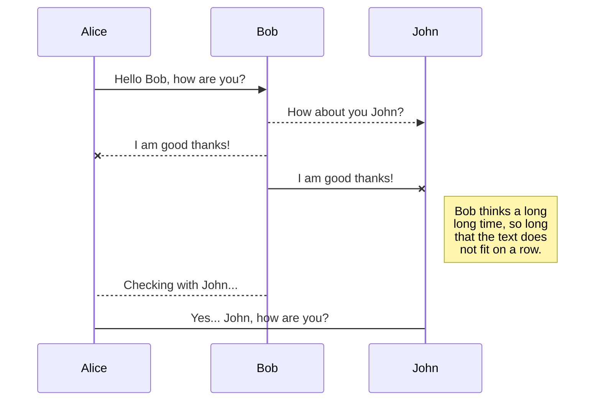
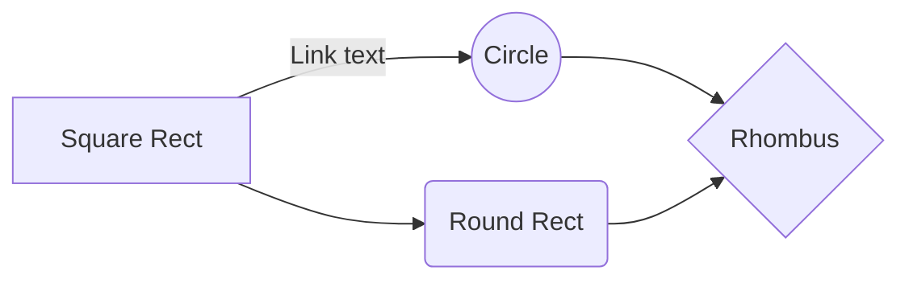

# Rapport de projet - Imac Tower Defense

**Cours d'algorithmique avancée - Cours de synthèse d'image**

*Jules Fouchy, Cyrielle Lassarre, Guillaume Haerinck*
*Année 1 - Promotion 2021*

## Table des matières

[**Introduction**](#introduction)

[**I - Présentation du jeu**](#ii---présentation-du-jeu)

*  [**Game Design**](#game-design)

*  [**Points forts**](#points-forts)

*  [**Justification des choix**](#différences-face-au-cahier-des-charges)

[**II - L'architecture ECS**](#ii---l'architecture-en-entity-component-system)

*  [**Historique**](#petit-historique-des-moteurs-de-jeux)
 (... todo quand ça sera terminé)

## Introduction

Notre projet de jeu 

## I - Présentation du jeu

> Mettre sitation création de jeux

### Game design

- Camera :
- Character :
- Controler :

Parler de ce qui se démarque d'un tower defense normal

### Points forts

Petite intro pour présenter le fait qu'un jeu regorge plein de trucs, mais qu'on a ces points qui ressortent

| Fonctionnalité| Description |
|--|--|
| Construction procédurale du graphe | ... |
| OpenGL Moderne | ... |
| Interfaces XAML | ... |
| Architecture ECS | ... |
| Nombreux design patterns | ... |

### Justification des différences face au cahier des charges

Expliquer les pour et contres, et le fait qu'on ai fait valider ça par des profs  

## II - L'architecture en Entity Component System

### Petit historique des moteurs de jeux

Reprendre video [https://www.youtube.com/watch?v=JxI3Eu5DPwE&t=546s](https://www.youtube.com/watch?v=JxI3Eu5DPwE&t=546s)

### Explication du principe de l'ECS

### Les limites et avantages de l'ECS

  

## III - Étapes du projet et résolution de problèmes

### OpenGl moderne (profil core version 4.4)

### Intégration de ENTT

... (piocher dans le changelog.md)

## IV - Post-Mortem

### Les problèmes à éviter

### Les améliorations futures

### Ce que le projet nous a appris

## Conclusion

## Annexe

### Articles

### Dépendances

# REMOVE ME

StackEdit extends the standard Markdown syntax by adding extra **Markdown extensions**, providing you with some nice features.

> **ProTip:** You can disable any **Markdown extension** in the **File properties** dialog.

## KaTeX

You can render LaTeX mathematical expressions using [KaTeX](https://khan.github.io/KaTeX/):

The *Gamma function* satisfying $\Gamma(n) = (n-1)!\quad\forall n\in\mathbb N$ is via the Euler integral

$$
\Gamma(z) = \int_0^\infty t^{z-1}e^{-t}dt\,.
$$

> You can find more information about **LaTeX** mathematical expressions [here](http://meta.math.stackexchange.com/questions/5020/mathjax-basic-tutorial-and-quick-reference).

## UML diagrams

You can render UML diagrams using [Mermaid](https://mermaidjs.github.io/). For example, this will produce a sequence diagram:

And this will produce a flow chart:

<!--stackedit_data:
eyJoaXN0b3J5IjpbMjAyMzUxNTg3Ml19
-->