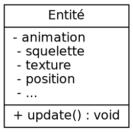
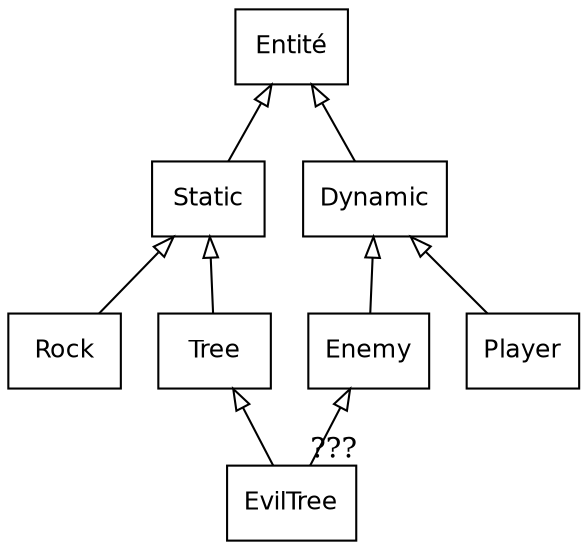
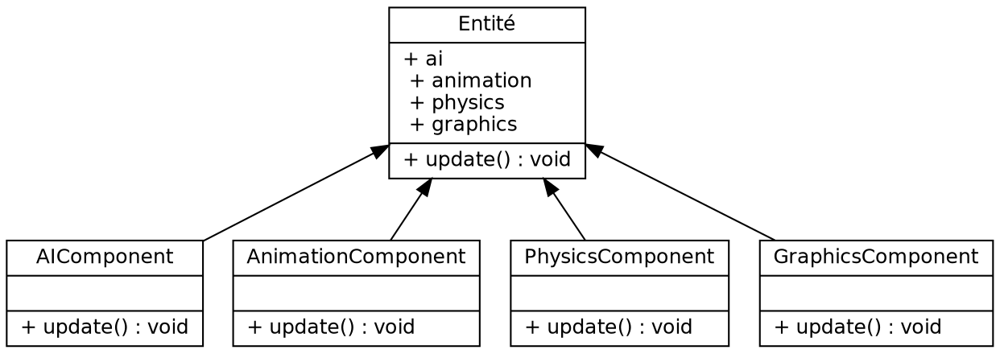


# Rapport de projet - Imac Tower Defense


**Cours d'algorithmique avancée - Cours de synthèse d'image**

*Cyrielle Lassarre, Guillaume Haerinck, Jules Fouchy*
*Année 1 - Promotion 2021*

## Table des matières

[**Introduction**](#introduction)

[**I - Présentation du jeu**](#i---présentation-du-jeu)
*	[**Intentions**](#intentions)
*  [**Points forts**](#points-forts)
* [**Différences avec le sujet**](#différences-avec-le-sujet)

[**II - L'architecture ECS**](#ii---larchitecture-ecs)
*  [**Contexte**](#contexte)
*  [**Principe**](#principe)
*  [**Implémentation**](#implémentation)

[**III -  En route vers le premier prototype**](#iii---en-route-vers-le-premier-prototype)
*	[**Utilisation d'openGL Moderne**](#utilisation-de-opengl-moderne)
*	[**Ajout des dépendances**](#ajout-des-dépendances)
*	[**Création des entités**](#création-des-entités)
*	[**Fichier ITD et construction du graphe**](#fichier-itd-et-construction-du-graphe)

[**IV -  L'ajout de mécaniques de jeu**](#iv---lajout-de-mécaniques-de-jeu)
*	[**Déplacements des ennemis**](#déplacements-des-ennemis)
*	[**Lasers**](#lasers)
*	[**Effets de feedback**](#effets-de-feedback)
*	[**Interface graphique avec Noesis**](#interface-graphique-avec-noesis)

[**V -  La solidification du projet**](#v---la-solidification-du-projet)
*	[**State Machine**](#state-machine)
*	[**Direction artistique**](#direction-artistique)
*	[**Animations**](#animations)
*	[**Système de tuiles**](#système-de-tuiles)

[**VI -  Post-Mortem**](#vi---post-mortem)
*	[**Cyrielle Lassarre**](#cyrielle-lassarre)
*	[**Guillaume Haerinck**](#guillaume-haerinck)
*	[**Jules Fouchy**](#jules-fouchy)

[**ANNEXE**](#annexe)
<!--
*	[**Liste des pattern utilisés**]
*	[**Schéma UML du projet**]
-->
*	[**Bibliographie**](#bibliographie)
*	[**Lexique**](#lexique)

<p align="center">

</p>

## Introduction

En nous lançant dans ce projet, nous avions le souhait de créer une base de moteur de jeu assez solide pour être réutilisable lors de notre prochaine année à l'IMAC.

En sachant que le temps passé à créer la structure d'un logiciel et à apprendre des librairies tierces est conséquent, nous avons décidé de réserver ce temps maintenant afin d'avoir une plus grande marge de manœuvre à l'avenir. En résulte un projet avec de nombreuses dépendances, qui utilise plusieurs design patterns propres à l'industrie du jeu vidéo, et qui pousse ces systèmes dans leurs retranchements pour s'assurer qu'ils soient bien structurés. Les points techniques majeurs sont :

- Architecture logicielle en ECS,
- Création d'interfaces dans le language XAML,
- Utilisation de OpenGl 4.4 core

## I - Présentation du jeu


*Lasers, Mirrors & Robots* est un jeu en vue de 3/4 où vous devez repousser vos assaillants en plaçant des miroirs aux points stratégiques. Les ressources disponibles étant rarement suffisantes, il faudra exploiter au maximum les unités déjà déployées pour arriver au bout de chaque niveau.

### Intentions

Le Tower Defense est un genre extrêmement codifié, si bien qu'il peut être compliqué de différencier les nombreux jeux flashs du genre disponibles en ligne. Avec un peu de recherche, on peut cependant tomber sur des propositions assez innovantes, ayant extraites certaines mécaniques du genre, mais s'étant dirigées vers un autre type d'expérience.

À l'instar de ces jeux, nous ne souhaitions pas créer un énième clone du genre, mais plutôt nous approprier le sujet en proposant quelque chose d'unique. Conscients des contraintes à respecter, nous avons décidé de trois axes visant à apporter de la fraîcheur, tout en conservant la base du cahier des charges.

<p align="left">

</p>

#### 1. Rendre le joueur actif pendant les vagues

Typiquement dans un Tower Defense, chaque niveau de jeu se divise entre une phase de construction et une phase d'attaque. Le joueur a des tours qu'il doit placer au mieux, puis il lance la vague pour voir si ses défenses tiennent bon. Avec un peu de chance, il gagnera assez de points pendant l'attaque pour construire de nouveaux bâtiments.

Le problème posé par cette structure est que le joueur n'a **pas grand chose à faire lors de l'attaque**, si ce n'est regarder ce qui se passe à l'écran et croiser les doigts pour que tout se passe au mieux. C'est une structure qui fonctionne, mais qui commence à accuser son âge.

Afin de pallier cette inactivité, nous avons décidé de construire les niveaux de sorte à ce qu'il soit impossible de couvrir l'ensemble de la zone de jeu. La conséquence est que le joueur sera obligé de désactiver des lasers et déplacer ses miroirs à de multiples reprises pour suivre l'évolution de l'attaque.

<p align="left">

</p>

#### 2. Proposer des choix intéressants

Tout jeu peut se résumer en une suite de choix. Qu'il s'agisse de sélectionner son opposant, un chemin à traverser, ou encore de placer des tours. Il est défini qu'un choix intéressant repose sur l'opposition entre un risque et une récompense. Plus grande pourrait être la récompense, plus grand sera le risque.

Dans un Tower Defense, les choix ont lieu lors de la sélection du type de tours, et lors du placement des unités. Cependant, il n'est pas rare que ces choix aient **très peu de conséquences** car le système est extrêmement permissif : il n'y a pas vraiment de mauvaise décision, et il est simple de rattraper un mauvais placement.

Pour ajouter du poids à ce genre de décisions, nous avons choisi de fixer le nombre d'unités qu'il est possible de créer par niveau, le compteur n'augmentera pas pendant la partie. Afin d'enfoncer le clou, certains niveaux nécessitent de sacrifier des constructions pour être terminés. En résulte un système où chaque placement doit réellement être prit en considération.

> I wanted to force [the player] to make difficult decisions and experience both the satisfaction of choosing correctly and the regret of choosing poorly.
> **Derek Yu**, *Créateur de Spelunky*

Il est légitime de se demander si imposer de telles contraintes ne risquerait pas d'aller à l'encontre du jeu, et nuire à l'expérience. Nous pensons que la véritable question réside dans le choix de ce que l'on veut proposer. Dans notre cas, nous nous dirigeons vers l'aspect plus intense de ce spectre, car il propose des expériences - à notre sens - plus fun, à l'image de ce que peut être le jeu d'aventure/plateforme Spelunky face à un Mario.

<p align="left">

</p>

#### 3. Résoudre plusieurs problèmes avec la même mécanique

Quand on commence le développement d'un jeu, et que plusieurs niveaux sont déja en route, il est récurrent d'imaginer de nouvelles mécaniques à utiliser et intégrer. L'expérience indique cependant que ce n'est pas forcément une bonne idée. Comme de nombreux game designers l'expliquent, avant de **chercher ailleurs**, il faut déja utiliser ce que l'on a.

> A good idea is something that does not solve just one single problem, but rather can solve multiple problems at once
> **Shigeru Miyamoto**, *Créateur de Mario*

Notre projet a une taille et une équipe réduite, qui a peu d'expérience. Pour rajouter du poids à cet argumentaire, développer de nombreuses fonctionnalités serait, au mieux, irréaliste. C'est pour cela que l'entièreté de nos niveaux sont structurés autours de seulement trois types de constructions très différentes : des miroirs, des lasers et des tours de glace.

Notre réflexion autour de ces éléments est toujours en cours. Nous avions le souhait de créer un principe équivalent à ce que l'on peut retrouver dans un jeu de "Pierre Feuille Ciseau", c'est à dire que chacun des objets en jeu doit se compléter et interagir avec les autres. Parmi les mécaniques citées ci-dessous, certaines ont été intégrées, et d'autres seront amenées à évoluer au fil des tests :

- Envoi de boules de feu quand le laser touche la tour de glace,
- Activation d'élements du décors par le laser,
- Activation et désactivation du laser pour éviter des types d'enemis précis,
- Séparation du laser en deux s'il arrive sur l'arrête du miroir,
- Renvoi d'attaques ennemies grâce aux miroirs

### Points forts

Au delà d'avoir utilisé des librairies spécifiques, nous avons pris soin d'intégrer ces quelques autres fonctionnalités pour améliorer le rendu en jeu.

Nom 		 					| Description
------------------------------- | ------------
Graphe à partir de l'image 		| Nous construisons le graphe en analysant pas-à-pas l'image du niveau, simplifiant ainsi l'écriture des fichiers .itd
Animations avec [Array Texture](https://www.khronos.org/opengl/wiki/Array_Texture)	| Nos entités animées le sont à l'aide de spritesheets, envoyées à openGl sous une donnée optimisée de Array Texture
Réflexion des lasers				| Notre mécanique de jeu principale repose sur le lancer de lasers
Système de tuiles 				| Nous détectons pour chaque tuile de la carte les tuiles aux alentours afin d'adapter la texture de manière cohérente
Animations de menu              | À l'aide de la bibliothèque Noesis et de Microsoft Blend, nous avons pu animer nos menus de jeu d'une façon semblable à des outils comme After Effects
Data Oriented                   | L'entièreté des données des niveaux sont récupérées depuis les fichiers .itd, c'est à dire pré-construction d'entités, durée des vagues, consitutions des menus, etc...

###	Différences avec le sujet

Bien que nous ayons suivi la base du projet, consistant à créer un jeu de Tower Defense avec des niveau construits à partir d'images et de fichiers textes, nous avons progressivement emprunté des points de divergences listés ici bas.

Différence 		 				| Motivation
------------------------------- | ------------
Les nœuds du graphe de déplacement sont déterminés à partir du png représentant la carte plutôt que d'être lus dans le .itd. | Permet de créer de nouveaux fichiers .itd beaucoup plus simplement
Système de grille plutôt que placement libre | Le joueur n'a pas à se préoccuper du positionnement exact des tours pour optimiser l'espace, mécanique que nous ne voulions pas implémenter. Le jeu s'en retrouve plus lisible
Dans le png, un pixel représente une case plutôt que d'avoir des disques de 30 pixels | Facilite la lecture du png
Tours laser, ralentissante et miroirs plutôt que 4 types de tours projectiles, des centrales et des bâtiments pour améliorer leurs statistiques | Nous souhaitions que chaque mécanique implantée en jeu ai un réel impact et soit simple à appréhender. À force de test et d'expérimentations, nous avons fini par remplacer les différentes tours assez semblables par trois réellement différentes: les lasers, les miroirs et les tours de glaces. La centrale et l'armement, qui devaient alimenter et améliorer les tours, sont des objets possédant trop peu de fonctionnalités et d'impact pour être pertinent dans notre système de quasi "Pierre, feuille, ciseau". Nous avons donc gardé l'idée de l'alimentation, mais fait le choix de rendre l'action accessible et rapide au travers du click, ce qui correspond au gameplay nerveux que l'on recherche
Déplacement selon le plus court chemin | Le choix est aléatoire, le chemin le plus court est le plus probable mais tous les chemins sont possibles, ce qui apporte de la diversité dans le mouvements des ennemis lors des vagues.
Dossiers ressources, include et lib | La structure de dossier proposée ne pouvait pas correspondre à la complexité des librairies que nous utilisons, ainsi qu'a la diversité des assets. D'où la disposition par bibliothèque du dossier lib, ainsi que le rassemblement des ressources dans le dossier res.

## II - L'architecture ECS

L'Entity Component System est un Design Pattern principalement utilisé lors de la conception de jeux vidéos.  C'est une architecture logicielle conçue à la fois pour optimiser la gestion de la mémoire, simplifier l'ajout de fonctionnalités et diviser les systèmes en parties totalement indépendantes. C'est un concept qui a progressivement émergé il y a une dizaine d'années et qui semble être devenu assez commun, bien qu'il existe, comme nous allons le voir, différents degrés dans son intégration.

### Contexte

Cela ne surprendra personne, créer un jeu, et plus particulièrement un moteur de jeu, est une tâche extrêmement complexe. À la lecture de [Game Engine Architecture](https://www.gameenginebook.com/), on comprend que ces logiciels sont des bêtes féroces autant dans la profondeur technique de ce qu'ils manipulent que dans la diversité des tâches à gérer. Rendu, physique, animation, intelligence artificielle pour ne citer que les pans les plus évidents, tous ces morceaux doivent être efficaces, bien organisés et surtout communiquer entre eux.

À la base de toute cette technique se trouve le **principe d'entité**. Parfois appelé Actor comme dans l'Unreal Engine et Wolfenstein Engine ([véridique](https://maniacsvault.net/ecwolf/wiki/Classes:Actor)), ou même GameObject avec Unity3D. L'idée est d'avoir un type à la racine, assez abstrait, duquel l'essentiel des objets affichés à l'écran sont dérivés. Avoir une telle base commune permet aux différents pans du moteur de manipuler aisément l'intégralité des objets sans avoir à se soucier de leur type.

#### 1. Approche Monolithique

L'approche la plus simple consiste à avoir une classe de base qui possède elle-même les différents systèmes avec lesquels elle doit interagir.

<p align="center">

</p>

<!--

-->

Le problème le plus évident posé par cette architecture est la **complexité**. Comme cette classe détient une grande partie de ce qu'est le moteur, elle est très lourde à manipuler et on peut se retrouver dans des projets conséquents avec une classe grande de centaines et des centaines de lignes.

#### 2. Approche par Héritage

Afin d'alléger la classe Entité, il est possible de tirer parti de la programmation orientée objet en utilisant l'héritage. Avec cette approche, on peut définir les besoins progressivement, les sortant ainsi de la classe mère.

<p align="center">

</p>

<!--

-->

Cependant, il peut devenir compliqué d'intégrer de nouvelles mécaniques de gameplay. L'exemple de "EvilTree" est assez parlant, à la fois Enemy et Tree, on ne pourrait le créer sans déclencher un **double héritage**, autorisé en C++, mais hautement déconseillé.

De plus, même si le code d'Entité a été simplifié, la division n'a pas été faite selon les systèmes du moteur de jeu. C'est à dire que le code gérant animation, physique et intelligence artificielle peut très bien être mélangé dans ces classes, posant des problèmes de performances et de maintenance.

> :fire: Bien que nous critiquions cette approche afin de nous amener à l'ECS, nous souhaitons préciser que des structures du genre plus complexes existent et s'en sortent très bien depuis des années.

#### 3. Approche par Aggrégation

En utilisant la POO avec un peu plus de subtilité, on se retrouve à faire de l'aggrégation, c'est à dire que les pans du moteurs de jeu interagissant avec les entités ont maintenant leur classe propre, et sont détenus par la classe Entité. Il s'agit du design pattern [Component](http://gameprogrammingpatterns.com/component.html).

<p align="center">

</p>

<!--

-->

Ce pattern à l'avantage de simplifier la structure et la compréhension du code, et permet aussi de mettre à jour les pans du moteurs de jeu dans un ordre précis.

```C++
void gameLoop() {
    for (entity in entities) {
        entity.ai.update();
    }
    for (entity in entities) {
        entity.animation.update();
    }
    for (entity in entities) {
        entity.physics.update();
    }
    for (entity in entities) {
        entity.graphics.update();
    }
}
```

Bien que cette approche possède de réelles qualités et soit souhaitable dans de nombreux cas, elle a un problème majeur : la **vitesse**. En effet, bien que la vitesse des processeurs se soit accrue, il n'en n'est pas de même pour la vitesse d'accès à la RAM.


Pour pallier ce problème, les constructeurs ont intégré au fil des années différentes mémoires caches directement sur le processeur, nommées par importance L1, L2 et L3. L'idée est, grossièrement, de passer les zones de mémoires de la RAM en cours d'utilisation dans ces mémoires caches côté processeur, beaucoup plus rapide d'accès, mais aussi très petites. L'efficacité de ce procédé repose sur l'hypothèse que les données en train d'être manipulées sont côte-à-côte dans la RAM, sous peine de rater l'emplacement **(cache miss)** et de devoir demander les données à la RAM.

Avec une architecture en component agrégés, voici l'état de la RAM. Chaque entité possède trois components, représentés par un carré de couleur : un beige, un vert et un violet. Les entités sont stockées à la suite, c'est une structure dîte **"Array of structure"**. Avec cette disposition, beaucoup de cache miss aura lieu lors d'une boucle principale, car on cherchera à accéder à tous les orange, puis tous les verts, puis tous les violets. Et la perte en terme de temps est assez colossale.

<p align="center">

</p>

La solution à ce problème est une structure en **"Structure of array"** représentée ci-dessous. Maintenant, les composants sont continus en mémoire, et le cache peut joueur son rôle efficacement.

<p align="center">

</p>

Pour intégrer un tel fonctionnement, il est possible de créer un gestionnaire de mémoire à la main, qui irait s'occuper de cette allocation et du bon placement des composants. C'est une approche qui est loin d'être triviale, mais qui est couramment utilisée dans les moteurs de jeu pour s'assurer que la mémoire n'est pas fragmentée. DOOM y avait déja recours en 1991, comme indiqué dans [Game Engine Black book](http://fabiensanglard.net/gebbdoom/).

Cependant, ce n'est pas l'approche que nous avons empruntée. Face à ces problèmes, nous avons choisi d'utiliser l'ECS, car c'est une architecture qui offre nâtivement un gain de performance, et qui, - et c'est le point qui nous intéresse réellement - offre une **nouvelle façon de structurer son application**. 

### Principe

L'Entity Component System est une architecture assez déstabilisante quand on est habitué à l'orienté objet. Assez semblable à la manipulation d'une base de donnée type SQL, il faut se faire à l'idée de séparer la logique dans des emplacements totalement séparés du code.

#### 1. Les entités

Encore une fois, l'entité est au cœur de l'architecture. Cette classe a commencé à perdre du poid depuis le début du rapport, jusqu'à en arriver à l'anorexie: dans une architecture ECS, **une entité n'est qu'un ID**, c'est à dire un entier, rien de plus.

Il est unique et permet, exactement comme dans une base de donnée, de faire des requêtes afin d'ajouter, de modifier et d'obtenir ses composants.

#### 2. Les composants

Les composants sont des **structures de donnée basiques** qui représentent un comportement en jeu. Par exemple, si une entité doit avoir une position dans le jeu, on va lui assigner un composant "Transform", qui possède deux nombre flotants, x et y.

Chaque entité va donc posséder un nombre plus ou moins important de composants selon la complexité de son comportement en jeu. Voici des exemples de composants basiques tiré d'un article sur l'[ECS](https://medium.com/@savas/nomad-game-engine-part-2-ecs-9132829188e5) :

<p align="center">

</p>

#### 3. Les systèmes

Les systèmes sont l'endroit où la **logique du jeu** est traitée. Ce sont eux qui s'occupent de parcourir les entités pour modifier leurs composants. On peut diviser notre application en autant de systèmes que l'on souhaite, typiquement ce seront les pans de notre moteurs de jeu (animation, physique, etc...) ainsi que la gestion de fonctionnalités avancées (construction, vagues, etc...).

Les systèmes vont récupérer les entités en utilisant les composants comme requête. Seules les entités possédant l'ensemble des composants demandés dans la requête seront retournés. Afin d'affiner encore plus la recherche, il est courant de créer un composant jouant le rôle d'un tag. Les enemis par exemple, peuvent tous posséder un composant "EnemyTag". Voici une autre image tirée du même article pour illustrer les besoins des systèmes :

<p align="center">

</p>

#### Les Avantages

On peut se demander pourquoi utiliser une architecture aussi radicalement différente pour créer son application. Déjà évoquées plus haut, nous allons rappeller ici brièvement les raisons d'utiliser ce système :

- **Performance**: Les composants sont des structures de donnée basiques, stockés en "Structure of Array" et demandés en groupe. Il est difficile de faire plus optimisé que ça.

- **Division**: Les systèmes regroupent la logique du jeu dans des classes totalement séparées. Ils sont mis à jour quand on le souhaite et dans l'ordre que l'on souhaite. Le code est organisé et on possède un contrôle total.

- **Prototypage**: Si on oublie le temps passé à comprendre l'ECS, une fois en route il est simple et rapide d'ajouter et de supprimer des fonctionnalités à la volée. Il suffit pour cela de créer un composant et de le gérer dans un système.

C'est une approche qui possède aussi des inconvénients, mais ces explications sont pour la fin du rapport.

### Implémentation

Créer une architecture d'une telle complexité par nos propres moyens aurait été une erreur.

En commençant le projet, nous voulions apprendre à utiliser, à penser en terme d'ECS. Nous n'avions qu'une vague compréhension de son fonctionnement, et nous manquions et manquons toujours de l'expérience et de l'expertise technique pour programmer un tel système. Nous sommes donc partis à la recherche de librairies C++.

> Give a man a game engine and he delivers a game. Teach a man to make a game engine and he never delivers anything.
> **@sandbaydev**

Deux librairies Libres et Open-Source sont actuellement réputées chez les développeurs de jeu indépendants : [EntityX](https://github.com/alecthomas/entityx) et [ENTT](https://github.com/skypjack/entt). La seconde possédant un développement actif, en plus d'être une amélioration directe de la première, nous avons choisi la **providence ENTT** :rainbow:.

<p align="center">

</p>

Après trois mois à l'utiliser, nous pouvons affirmer que cette librairie est extrêmement bien conçue. En plus d'être rapide, cohérente et bien documentée, elle possède, à l'image de SDL, des sous-bibliotèques qui sont susceptibles d'être utilisées par tout développeur ayant recours à la libraire.

Dans notre cas, il s'agit d'une base d'implémentation pour le design pattern [Event Dispatcher](http://gameprogrammingpatterns.com/event-queue.html) et [Service Locator](http://gameprogrammingpatterns.com/service-locator.html) que nous utilisons massivement dans notre jeu. Ces qualités, nous ne sommes pas les seul à les avoir reconnues, on peut noter que des jeux comme [Minecraft](https://www.minecraft.net/fr-fr/) (oui, minecraft rien que ça) utilisent ENTT dans leur développement.

Dans sa dernière version, la librairie requiert d'utiliser C\++17, ce qui est impossible pour builder sur les ordinateurs de Copernic. Nous utilisons donc une ancienne version, compatible avec C\++14 et qui compile à l'université.

#### La colonne vertébrale de notre application

Comme vous le constaterez tout au long de ce rapport, l'architecture de notre application s'est bâtie progressivement pour devenir assez complexe aujourd'hui. Néanmoins, deux objets sont au centre depuis le début et font fonctionner cette machinerie infernale :

- Le Registre
- L'Event emitter

Concrètement, **le Registre est notre base de données**. C'est un objet ENTT qui est obligatoire pour toute utilisation de la libraire, et c'est avec lui qu'on crée les entités, ajoute des composants et effectue des requêtes pour récupérer et modifier les composants dans les systèmes. Il est créé dans notre classe **Game** et est passé par référence dans la quasi-totalité de nos classes. C'est simple, dès qu'un endroit du code a besoin de manipuler les entités, il est nécessaire d'avoir accès à cet objet.

<p align="center">

</p>

<!--
```mermaid
graph TD
A[Publisher] -- Event -- B((Event Bus))
B -- Event -- C[Subscriber]
B -- Event -- D[Subscriber]
```
-->

L'Event Emitter ensuite est ce qui **assure la majeure partie de la communication** au sein de notre application. C'est d'ailleurs le seul moyen de communiquer entre les systèmes. La syntaxe et le comportement sont semblables à ce que l'on peut retrouver en *javascript* avec les event-listeners. L'idée est qu'avec cet objet on peut publier des évènements et y souscrire, le tout sans avoir besoin d'update cet objet directement dans une boucle. Le contenu de chacun de ces events est défini dans une structure de donnée très proche des components. 

Même s'il est moins propagé que le registre, cet objet est lui-aussi passé en référence dans le constructeur de nombreuses classes de notre jeu.

#### La structure générale

Si on commence à jeter un œil dans le dossier `src` on observe le point d'entrée de l'application `main.cpp`. Le rôle de ce fichier est de créer notre classe mère **Game** (présente dans le dossier `core`), ainsi que de gérer la game loop, l'interface de débogage et de propager les événements SDL.

Parce que c'est l'emitter qui lance les événements, on le créé dans le main afin d'y avoir accès facilement dans ce fichier, et Game en récupère la référence. Autre point important : parce que la communication avec OpenGl ne peut s'effectuer qu'au runtime, on utilise une fonction pour initialiser la classe plutôt que de le faire dans le constructeur. C'est game qui possède le registre, et d'autres objets centraux de l'application.

```C++
EventEmitter emitter{};
Game game(emitter);
game.init();

while(true) {
	game.update(deltatime);
}
```

Notre classe Game est en réalité une **StateMachine** (expliqué dans la suite du rapport). 

Il existe plusieurs classes de type GameState, et seule celle qui est activée est mise à jour. Ces GameState ont une interface commune, mais sont très libres dans leur utilisation, rendant possible toutes nos envies créatrices. Typiquement, un état correspond à un type d'écran en jeu, mais cela n'est pas une règle immuable.

<p align="center">

</p>

<!--
```mermaid
graph TD
A[Game]
A -- E[Level]
B(*GameState*) -- A
B(*GameState*) -- C(*GUI*)
B(*GameState*) -- D(*Systems*)
B(*GameState*) -- F(*EntityFactories*)
F -- G(*ComponentFactories*)
```
-->

#### Structure de dossier

Pour structurer notre arborescence, nous avons privilégié une **approche déclarative** plutôt que par type de fonctionnalité afin de simplifier la compréhension du rôle de chacun des fichiers.

*(Une approche par fonctionnalité, aurait été d'avoir les dossiers organisés par états du jeu, chacun des ces dossiers ayant ses propres components, factories, events, etc... Un dossier "shared" à la racine permettant de récupérer ce qui est utilisés par tous ces états. )*

| Dossier | Description |
| ------------- | ----------------- |
| **src** | **Code Source** |
| `main.cpp` | Point d'entrée du jeu |
| `components` | Struct de données utilisés par les entités |
| `component-factories` | Création des components complexes |
| `entity-factories` | Création des entités |
| `events` | Struct de données transmis par un événement |
| `graphics` | Classes wrapper pour les objets OpenGL |
| `gui` | Les classes dîtes "Code Behind" utilisés par Noesis pour manipuler les fichiers XAML avec le design pattern View Model |
| `logger` | Gestion des erreurs et des fichiers de logs pour la debug |
| `services` | Fonctionnalités utilisées n'importe où, comme jouer un son ou avoir du random. Utilisation du design pattern Service Locator |
| `systems` | Mise à jour des entités par sélection de leurs composants. Toute la logique du jeu est présente dans ces classes |
| **core** | **Constantes, Chargement de la carte et Gestion de la State Machine** |
| `game-states` | Les différents états de notre jeu (title menu, in-level, game over, ...) |
| `level` | Lit les fichiers .itd et construit le graphe |
| **res** | **Ressources chargées au runtime** |
| `audio` | Sons et musiques |
| `fonts` | Les police de caractère utilisées par les interfaces |
| `gui` | Les fichiers XAML décrivant les interfaces pour chacun des états de jeu |
| `images` | Images et Spritesheets utilisées par le jeu |
| `levels` | Fichiers .itd et leurs images associées |
| `shaders` | Shaders GLSL utilisés par OpenGL |
| **doc** | **Documentation** |
| **lib** | **Dépendances** |

## III - En route vers le premier prototype

La première grande étape a été de rassembler toutes les dépendances et besoins techniques du projet, et de les faire fonctionner. Nous avons cherché à identifier nos besoins à l'avance afin de ne pas rajouter plus de complexité à un projet qui n'en manquait déja pas sur le papier.

<p align="left">

</p>

### Utilisation de OpenGL Moderne

Le premier challenge et la première réussite a été l'utilisation de la version moderne d'OpenGl. Au revoir *glBegin()* et *glEnd()*, et bonjour à vous les buffers et autres drawcalls. Nous avions commencé à apprendre OpenGl au lancement des cours de Synthèse d'image, donc bien avant le début du projet, ce qui nous a permis assez rapidement de passer cette étape.

Cet apprentissage a commencé grâce aux excellents tutoriels du développeur [Yan Chernikov](https://www.youtube.com/user/TheChernoProject). Tout au long de ses vidéos, nous avons pu construire des classes pour abstraire les objets d'OpenGl et les manipuler plus aisément. Ces classes se trouvent dans le dossier `graphics`.

 Classe	| Description
 --- | ---
 VertexBuffer | Permet de gérer la création, la sélection et la suppression de données
 VertexBufferLayout | Permet de gérer facilement la disposition des données en SOA dans le buffer
 VertexArray | Permet de gérer les différents VertexBuffer d'un objet. C'est cette classe que l'on utilise pour chaque type d'entité au travers de la **SpriteFactory** et de la **PrimitiveFactory**
 IndexBuffer | Instancié une unique fois dans la **SpriteFactory**, car tous les sprites utilisent le même (Plus d'explication plus bas)
 Texture | Crée et envoie les données d'une image à OpenGl, on sauvegarde l'id de texture renvoyé et on supprime cette classe juste après (la suppression de texture est gérée par la **SpriteFactory**)
 TextureArray | Même principe que pour Texture, sauf qu'elle est spécifique et optimisée pour des images de type SpriteSheets
 Shader | Prend un vertex et un fragment shader dans le constructeur, et s'occupe de leur compilation. S'occupe aussi de retrouver les Uniform à l'aide d'une Hashmap. On instancie plusieurs objets de cette classe au travers des **SpriteFactory** et **PrimitiveFactory**, mais aussi dans le service **DebugDraw**. 
 FrameBuffer | (Pas encore implémenté)
 

#### Des restes du immediate mode

En règle générale nos dessins par OpenGl sont fait dans les règles de l'art : On envoi nos tableaux de vertex une unique fois à la carte graphique lors de la création d'un type d'entité. Puis à chaque frame, on update sa position dans le vertex shader à l'aide d'un uniform qui représente la matrice MVC.

Cependant, nous disposons aussi d'un service **"Debug Draw"**, auxquel on peut accéder à n'importe quel endroit dans le code pour dessiner des formes simples. Comme on ne connaît pas à l'avance ce qu'on vas vouloir dessiner, cette classe ne déclare qu'**un seul buffer de données** à OpenGl. Ce dernier est mis à jour avec la fonction *glBufferData* à chaque fois que l'on demande le dessin d'une forme, c'est à dire plusieurs fois par frame.
 
*(Il existe un moyen plus optimisé de mettre à jour le buffer avec *glBufferStorage*, mais son utilisation causait des problème avec nos drivers NVidia, donc nous l'avons laissé ainsi pour le moment).*

Concrêtement, cette technique est du immediate draw en OpenGl Moderne, c'est à dire un comportement semblable à ce qui est proposé par l'ancienne version d'OpenGl par les fonctions glBegin() et glEnd().

Pour nous donner bonne conscience, nous rattrapons cette mauvaise pratique par d'autres implémentations plus avancées. Bien que nous ne cherchions pas forcément la performance (à en voir le nombre de drawcall que nous émettons à chaque frame), mais plutôt à apprendre le fonctionnement de cette API, nous avons implémenté quelques optimisations offerte par OpenGL.

#### Array texture

C'est un type de texture présent dans le profil core depuis la version 3.0. L'idée est de stocker de multiples textures dans un seul buffer afin de limiter le coût du "texture switching". Concrètement, on y stocke une spritesheet, et on utilise un uniform dans le shader pour changer la tuile qui est active. Les texture coordinates restent identiques, sauf pour le paramètre *z* qui correspond à la tuile à activer, c'est-à-dire à l'index de ce tableau de texture.

<p align="center">

</p>

#### Index Buffer

Très clairement inutile sachant que nous n'affichons que des carrés composés de deux triangles. Il n'empêche qu'utiliser un indexBuffer pour éviter de dupliquer les coordonnées de vertex dans le buffer envoyé à OpenGl est une bonne pratique, que nous avons donc utilisée.
<br>
<p align="center">

</p>

#### Vertex Array partagés

Nous n'utilisons pas encore de "Instance Draw" qui permettrait d'indiquer à OpenGL qu'un même objet est dessiné plusieurs fois. Cependant, nous partageons tout de même nos VertexArray entre les entités qui utilisent la même texture, au lieu d'en générer une à chaque création.

On peut donc assimiler ce comportement au design pattern [FlyWeight](https://gameprogrammingpatterns.com/flyweight.html), car une seule instance d'une classe est utilisée pour plusieurs objets en jeu.


### Ajout des dépendances

Notre projet utilise de nombreuse dépendances, pour les gérrer, il était quasiment indispensable d'utiliser CMake. Afin de s'assurer que tout fonctionne, nous avons intégré l'entièreté de ces librairies dès le début du projet, quitte à ne pas en utiliser certaines (comme Box2D). Le *CMakeLists.txt* a été construit de sorte à ce que notre projet compile à la fois sur Windows et sur Linux. Toutes ces librairies sont présentes dans le dossier `lib`

<p align="left">

</p>

Pourquoi ne pas utiliser SDL 1 comme en cours pour créer un fenêtre ? Parce qu'il n'est pas possible de demander une version d'OpenGL précise, et nous avons besoins de certaines fonctionnalités de la 4.4.

<p align="left">

</p>

Il s'agit de la libraire mathématique d'OpenGL, que l'on utilise lourdement pour gérer nos données de position avec le type vec2. Nous utilisons aussi les différentes facettes de la librairie dans notre système de rendu lors des calculs de matrices.

#### SPDLog

Comme nous savions que notre architecture logicielle allait être conséquente, il était nécessaire d'utiliser un système de log pour la debug digne de ce nom. Avec SPDLog, on peut séparer les messages dans différents channels, et exporter l'output dans un fichier ou dans la console au choix.

<p align="left">

</p>

#### NeosisGUI

C'est une libraire qui s'occupe de lire, d'animer et d'afficher les fichiers XAML des interfaces pour le C++. Elle est très conséquente, et nous sommes toujours en train d'apprendre à l'utiliser et à la maîtriser.

#### Imgui

À l'inverse de Noesis, cette libraire produit facilement et rapidement des interfaces utilisateurs. Elle est beaucoup moins puissante, mais largement suffisante pour nos besoins de debug.

#### StbImage

Nous préférons utiliser cette librairie à la place SDLImage pour la simplicité d'utilisation et d'installation.

<p align="left">

</p>

Nous ne faisons qu'effleurer les possibilités offertes par FMOD pour jouer et faire évoluer des sons. Mais au moins, nous commençons à l'utiliser.

### Création des entités

Créer les entités est simple, il suffit de faire un appel au registre de ENTT pour obtenir l'id de l'entité créé :

``` C++
int entityId = registry.create();
```

Cependant, une entité est aussi et surtout un paquet de composants. Position, Sprite, Chemin, et la liste est encore longue. Afin de s'assurer de la création en bonne et dûe forme de chacun de nos types d'entités, nous avons créé un dossier `entity factories`, qui comme sont nom l'indique, est une utilisation du design pattern **Factory**.

On dispose donc d'une classe factory spécifique pour:

- Les ennemis (Robots et Kamikazes)
- Les miroirs (Un seul type pour le moment)
- Les projectiles
- Les tuiles de carte
- Les tours (Glace et laser)
- Les effets divers (Explosions, Particules, etc..)

Ces factory s’occupent d'assigner les composants pour nos différentes entités, mais il arrive que certains de ces composants aient besoins eux-aussi d'un constructeur : C'est le cas pour les Sprites et les Primitives, qui on besoin de charger et d'envoyer leurs données à OpenGl. Pour ces cas précis, nous avons crées d'autres factory, sous le dossier `component factories`

En plus de la simplicité d'utilisation, l’intérêt d'utiliser de telles classes factory et qu'elle permet de partager des données entre les différentes entités. En l’occurrence, comme expliqué plus haut en abordant le pattern Flyweight, ici ce sont les composants de type Sprite qui sont partagés entre les entités.

### Fichier ITD et construction du graphe

Le fichier .itd contient les informations sur le niveau : la vie dont dispose le joueur, le nombre d'ennemis de chaque type qui doivent apparaître, la position et l'orientation des structures déjà placées ainsi que le nombre de miroirs et de tours à disposition. En voici un exemple :

```
@ITD 1++
# ITD ameliore, pas besoin de donnees de graphes, et infos en plus.

carte level-1.png
intro-img level-1-intro.png
intro-text Use your wheel to rotate the mirror
exit-text Good start ! Ready for what's next ?

chemin 255 255 255
noeud 0 0 0
construct 0 0 255
in 0 255 0
out 255 0 0

energie 6
slow 0
mirror 0

robot 20
kamikaze 0
wave-rate 1

build-laser 7 6 3
build-mirror 7 3 1
```

Cette structure est simple, malléable et permet de rapidement prototyper et créer des niveaux. La structure de la carte, c'est à dire le type et la position des tuiles, ainsi que les données du graphes, sont quant à elles récupérées dans une image : un pixel représente une case, et sa couleur indique si il s'agit d'un chemin, d'une zone constructible ou d'une zone non-constructible. Voici un exemple de niveau :

<p align="center">

</p>

Pour se déplacer les ennemis utilisent un graphe qui contient toutes les positions des embranchements, puisque ce sont les seuls endroits où ils doivent changer de direction.

Pour rendre l'édition et l'ajout de niveaux aussi simple que possible, devoir spécifier la position des embranchements du chemin dans le fichier ITD était un énorme frein ; ajoutez à cela que cette information est totalement redondante avec l'image décrivant le niveau et il ne nous en fallait pas plus pour nous décider à nous affranchir de cette contrainte.

Le graphe est donc créé en parcourant l'image vue elle-même comme un graphe : on part de la case d'arrivée (puisqu'on sait qu'elle est unique et existe toujours) et on lance un parcours récursif sur chaque voisin de cette case qui est un chemin. Tant que la case actuelle n'est pas un embranchement (ce qu'on sait en regardant lesquels de ses voisins sont des chemins), on continue à avancer, et quand on tombe sur un embranchement on crée un nœud dans le graphe.

### Version 1

<p align="center">

</p>

## IV - L'ajout de mécaniques de jeu

Une fois le prototype en place, il était temps de rendre notre jeu jouable et intéressant. Pour se faire, nous avons commencé à expérimenter de nouvelles mécaniques de jeu.

### Déplacements des ennemis

Pour se déplacer, les ennemis ont une stratégie très simple : ils choisissent un nœud et se déplacent vers lui en ligne droite, puis choisissent un nouveau nœud quand ils ont atteint leur cible.

Le choix du prochain nœud est à peine plus subtil : il est choisi au hasard, avec une probabilité inversement proportionnelle à la distance (calculée par Dijkstra) entre ce nœud et l'arrivée.

À cela il faut juste rajouter le fait que les ennemis se refusent à choisir le nœud dont ils viennent (à moins qu'ils n'arrivent à un cul-de-sac) et ne choisissent pas non plus un nœud qui les éloigne de l'arrivée (au sens de la norme 1), ce qui – essentiellement – leur évite de tomber dans des boucles.

### Lasers

Nous souhaitions trouver une mécanique à la fois **simple, unique et pouvant offrir une profondeur intéressante** de gameplay. Après différentes idées (dont celle d'un principe de minage), nous nous sommes lancés vers la création et la réflexion de laser.

C'est un principe qu'il arrive de croiser dans le jeu-vidéo. On peut penser aux jeux types [Laser Chess](https://www.thinkfun.com/products/laser-chess/), à certains niveaux dans [Zack & Wiki](https://fr.wikipedia.org/wiki/Zack_et_Wiki_:_Le_Tr%C3%A9sor_de_Barbaros) où encore dans le jeu [Archaica : The Path of Light](https://store.steampowered.com/app/550590/Archaica_The_Path_of_Light/) qui y est dédié. Souvent, le laser a une position déja définie, et c'est au rôle du joueur de placer et tourner des mirroirs pour atteindre un emplacement précis. On savait donc que c'était une mécanique fun et qui pouvait potentiellement assez bien fonctionner dans un Tower Defense.

<p align="center">

</p>

Nous avions maintenant la tâche d’implémenter ce système.

Pour trouver la trajectoire d'un laser, on calcule l'intersection entre la demi-droite partant de la tour et *tous* les miroirs (oui on n'est pas très subtils), garde le point le plus proche et relance un laser depuis ce point, avec l'angle 
*2Theta mirroir - Theta laser incident*

Pour la collision entre le laser et les entités, on calcule la distance entre l'entité et sa projection orthogonale sur la droite, et vérifie si elle est plus petite que le rayon de la hitbox plus le rayon du laser. (Et on vérifie aussi qu'on est du bon côté de la demi-droite grâce au signe du produit scalaire utilisé pour calculer la projection orthogonale).

Quelques semaines après avoir implanté cette mécanique, nous sommes d'ailleurs tombé sur un autre jeu de tower defense qui tourne essentiellement autour. Il s'agit de [Lethal Laser](https://store.steampowered.com/app/669390/Lethal_Laser/).

<p align="center">

</p>

### Effets de feedback

Les héros de l'ombre du jeu vidéo ! Ceux qu'on ne remarque pas quand ils sont là, mais dont l'absence se fait cruellement sentir ! Nous avons été beaucoup inspiré par la conférence [The art of screenshake](https://www.youtube.com/watch?v=AJdEqssNZ-U) par Jan Willem Nijman, où il montre de façon concrète tout ce que ces effets peuvent apporter au jeu.  

Comme tout bon héros de l'ombre, ils sont un peu partout, et permettent au joueur de ressentir les effets de ses actions en jeu. En voici une présentation non exhaustive :

Description | Animation
--- | ---
Tremblement des entités et production d'étincelles quand elles sont touchées par un laser | 
Tuile colorée en rouge ou vert lors du placement des structures pour indiquer la constructibilité de la case | 
Curseur change pour indiquer l'action possible sur la structure (rotation des miroirs ou désactivation des tours) | 
Ennemis qui bleuissent quand ils sont ralentis | 
Apparition progressive des ennemis | 

### Interface graphique avec Noesis

Noesis est une librairie qui exploite le langage XAML développé puis rendu Open-Source par Microsoft. Concrètement, il est possible de créer des applications natives avec des interfaces développées dans un langage proche du HTML.

Ce que Noesis a fait, c'est adapter cette technologie aux besoins de performance et de temps réel du jeu vidéo. Bien que difficile à apprivoiser, cette librairie se trouve être d'une puissance assez inouïe quand il s'agit de l'animation des éléments. Déja dans le workflow que cette librairie propose, présenté ci-dessous :

#### Workflow


L'artiste fait ses design sur des outils qu'il connait, Photoshop, Illustrator, ou Affinity Designer dans notre cas. Une fois le design validé, il exporte ces créations en parties indépendantes afin qu'elles soient intégrable facilement dans le fichier XAML.

<p align="center">


</p>

L'intégrateur prend alors le relai, il peut tapper le fichier XAML à la main, mais pour créer des animations et des dispositions plus complexes il est quasiment indispensable d'utiliser Microsoft Blend. Cet outils permet d'éditer les interfaces en temps réel, d'animer une timeline tels After Effect, ainsi qu'une des modifications à la souris type WYSIWYG.

<p align="center">

</p>

Une fois cette mise en page validée et fonctionnelle, on peut commencer la création des classes "Code Behind" en C++.  Ces dernières utilisent le design pattern View Model et s'assurent de la bonne connexion entre les données, envoyées dynamiquement dans le code, et les fichiers XAML.

#### Intégration

Il existe deux façon d'implémenter Noesis dans son application. La première, la plus documentée et la plus simple, est d'utiliser leur ["Application Framework"](https://www.noesisengine.com/docs/Gui.Core.ApplicationTutorial.html), qui offre un nouveau *main* et s'agence parfaitement avec la structure d'une application WPF, permettant en plus de se passer de SDL pour créer une fenêtre. **Ce n'est pas l'approche que nous avons choisie**.

La seconde, tout aussi efficace mais plus complexe à comprendre car *beaucoup* moins documentée, est d'initialiser noesis et de créer un Renderer indépendant au reste de notre application. **Nous avons choisi cette approche** pour plusieurs raisons :

- L'Application Framework de Noesis est incroyablement moins propagée et "War tested" que SDL. L'utiliser est donc s'exposer potentiellement à de nombreux bugs et à une communauté plus petite,

- Bien que l'Application Framework soit open source, Noesis reste une librairie propriétaire. Avoir une architecture logicielle autant dépendante de cet outil est un danger potentiel. D'autant plus que d'autres librairies comme [Crazy Eddie's GUI](http://cegui.org.uk/) offre des solutions, certes moins puissantes, mais similaire et libre de droit,

- Enfin, intégrer nous-même cette librairie dans notre système de rendu signifie avoir un contrôle total sur celle-ci. Il peut très bien y avoir des moment ou nous souhaitons par exemple modifier le FrameBuffer de l'interface pour appliquer du flou ou un Overlay de couleur.

L'intégration n'a donc pas été sans heurt. Déja parce que le Renderer de Noesis performe de nombreuses opération, et que OpenGL fonctionne comme une state machine, il est nécessaire de réinitialiser son état à chaque frame après avoir mis à jour Noesis.

```C++
// Framebuffer
glBindFramebuffer(GL_FRAMEBUFFER, 0);
glViewport(0, 0, WIN_WIDTH, WIN_HEIGHT);
glClearStencil(0);

// Z-buffer
glEnable(GL_DEPTH_TEST);
glDepthFunc(GL_LEQUAL);
glDepthMask(GL_TRUE);

// Blending
glEnable(GL_BLEND);
glBlendFunc(GL_SRC_ALPHA, GL_ONE_MINUS_SRC_ALPHA);
glClearColor(1, 1, 1, 1);
```

Ensuite, parce que la création des classes dîtes "Code Behind" utilisent un pattern assez complexe de Reflection, qui permet grossièrement d'identifier des types au runtime, un peut comme avec un principe de Template. Nous n'avons - heureusement - pas eu à créer ce système nous-même. Néanmoins il nous faut l'utiliser, et la documentation encore une fois est beaucoup floue sur les étapes et l'emplacement de ces éléments dans le code.

#### Création des classes Code Behind

Ces classes sont présentes dans le dossier `gui`. Elles permettent de gérer les événements qui ont lieu dans les fichiers XAML, ainsi que de leur envoyer et mettre à jour les données, avec le principe de **Data Binding**. Pour l'utiliser, il faut créer une nouvelle classe qui consiste en un ensemble de getters et de setters, et qui sera appelé par la classe s'occupant des événements.

Une fois en place, que l'on a identifié les différentes méthodes à appeler, comment et quand les appeler, et comment sauvegarder leur résultat, oui, l'utilisation devient assez naturelle. Cependant, pour arriver à cet état, il nous a fallu faire de nombreux test, et comprendre des comportements assez étrange de la librairie. Il suffit de voir les deux première ligne du constructeur de n'importe quel classe GUI pour s'en rendre compte :

```C++
m_bindings =  *new  LevelHudBindings();
Initialized() +=  MakeDelegate(this, &LevelHud::OnInitialized);
```

### Version 2

<p align="center">

</p>

## V - La solidification du projet

Les briques de gameplay posés, nous pouvions améliorer tout ce qui pouvait l'être. C'est à dire autant dans l'architecture logicielle que de l'aspect visuel et tout ce qui touche de près ou de loin au **"Game Feel"**.

### State Machine

Nous n'avions pour le moment qu'un seul écran de jeu : Le niveau. En sachant que les autres écrans allaient être différents les uns des autres tant au niveau de la forme que du contenu, et que le passage entre eux devrait sûrement lancer une transition, le design pattern State a fini par s'imposer.

Ce dernier, qu'on apprend quand on commence à programmer des intelligence artificielles basiques, offre deux avantages :

- Un objet ne peut être que dans un seul état à la fois,
- En passant d'un état à un autre, on déclenche la sortie de l'état actuel, et l'entrée dans le nouvel état, idéal donc pour une transition.

C'est le livre [Game Programming Pattern ](http://gameprogrammingpatterns.com/state.html) qui nous a poussé à l'utiliser pour d'autres aspect que l'intelligence artificielle, dans son exemple excellent pour la gestion des inputs d'un personnage :

<p align="center">

</p>

#### Gestion du jeu

Nous avons décidé de divisé nos écrans en autant d'état du jeu. Ce sont donc 7 états indépendants qui possèdent chacun leur interface :

- Title screen
- Cinematic *(pas encore utilisé)*
- Level intro
- Level
- Level exit
- Game over
- End screen

Ils sont créés au besoin au runtime, et **une fois instanciés ils le restent** jusqu'à la fermeture du jeu pour optimiser l'utilisation de la mémoire. Le fait que ces objets restent créés nous impose de gérer la transition entre ces états. 

Parce que nos événements sont asynchrones, et n'ont pas besoin d'utiliser d'update pour être propagés, nous avons besoin de bloquer la souscription aux événements quand l'état n'est pas actif. Concrètement, l'objet qui devient actif souscrit aux événements de l'utilisateur, et retire cette souscription quand on quitte l'état. L'état reste souscrit cependant souscrit aux d'autres types d’événements que les inputs, rendant donc la division poreuse, mais nous n'avons pas encore trouvé de solution simple et efficace à ce problème.

```C++
void  LevelIntroState::enter() {
	connectInputs();
}

void  LevelIntroState::exit() {
	disconnectInputs();
}
```

#### Gestion des inputs

La gestion des inputs lors du "LevelState" aurait pu être assez problématique : gérer la construction, la sélection et les effets de hover appellent forcément à une gestion complexe des conditions. Pour palier ce problème, nous avons créé une nouvelle state machine pour s'assurer du bon fonctionnement des inputs. Elle est décrite ci-dessous.


### Direction artistique

Arrivé à cet étape, nous n'étions toujours pas satisfait du rendu en jeu : L'action était difficilement lisible quand ils y avait beaucoup de lasers, les éléments à l'écran se ressemblaient trop, les bords carrés des tuiles donnaient une impression d'amateurisme et on pouvait voir le fond noir de l'écran au bord de la carte. Avant de vous expliquer comment nous avons résolu ces problèmes, nous allons vous présenter comment ils ont pu se produire.

#### Les premiers essais

Au commencement du projet, nous avions mis un point d'honneur à adopter un bonne procédure de collaboration pour avancer **étape par étape**. Nous récupérions des fonctionnalités depuis le sujet, puis nous les prototypions en code avec des assets basiques, avant de demander un design plus aboutis et passer à l'étape suivante. Un peu comme illustré par cette image :

<p align="center">

</p>

Pour accélérer le rythme de création, le design lui même se devait d'être crée progressivement. En commençant par des croquis simples illustrant une mécanique de gameplay, avant de passer à l'ajout de couleurs et fixation des formes, avant d'enfin nettoyer le tout et proposer un design final.

<p align="center">


</p>

Dans nos première idées d'implémentation, nous souhaitions approfondir le sujet en ajoutant une mécanique de minage dans le jeu. Nous avons rassemblés des inspirations, puis avons fait un premier croquis de prototypage pour imaginer l'écran de jeu.

<p align="center">

</p>

Mais cette idée n'a pas tenu longtemps, car nous la considérions être beaucoup trop éloignée de ce qui nous était demandé, nous nous sommes donc re-centré sur des règles qui pouvaient être appliqués sur un tower defense, à savoir l'utilisation de laser. Les design du robots en vue de face ayant été créé et validés, ils sont restés en jeu, et d'autres éléments on été designés pour correspondre à nos nouveaux besoins.

<p align="center">


</p>

Un second croquis a été fait, ajoutant des détails et de nouveaux éléments. Le moment de l'intégration arrivé, nous n'avons pas questionné cet agencement. Ils avaient été validés au préalable, et beaucoup de travail était encore à faire.

<p align="center">

</p>

Le problème, c'est qu'une fois en jeu, nous avons seulement commencé à remarquer les problèmes évoqués en introduction. Parce qu'ils avaient été crée un a un, et pas ensemble, et parce qu'en plus il n'avaient pas été testé en jeu, ces assets et leur esthétique posaient problème.

Notre erreur a été de ne pas penser au design dans son ensemble, mais en prenant les éléments un a un. Comme nous nous étions accordé sur chacune des illustration, cela nous a en partie privé de notre esprit critique lorsque tout les éléments ont été ajoutés. Après un certain temps, nous avons donc fait le choix de **repartir d'une nouvelle base**, en prévoyant cette fois ci le rendu assemblé de bout-en-bout.

#### Nouvelles inspirations 

Comme tout créateur qui se respecte, nous avons été regardé sur la copie du voisin pour voir ce qui nous plaisait en terme de tower defense. Nous nous sommes stoppés sur des jeux à l'apect crayonnés, et avec une vue de 3/4 permettant des illustration beaucoup plus abouties. Par exemple pour ce jeu [Defense King](https://play.google.com/store/apps/details?id=com.mobirix.towerking&hl=en_US).

<p align="center">

</p>

En continuant nos recherches, nous avons rencontrés d'autres esthétiques intéressantes, et aussi plus à notre portée de création. Notamment l'oubli de couleurs pour favoriser des nuances de gris allait nous permettre de nous concentrer sur la forme et la différenciation des éléments, tout en nous offrants une esthétique très solide. Des jeux comme [Hidden Folks](https://hiddenfolks.com/) et des artistes comme [Dom2D](https://dom2d.tumblr.com/) et [Steven Cooling](https://stevencolling.itch.io/inked-adventure-items) ont été une grande source d'inspiration.

<p align="center">

</p>

<p align="center">

</p>


#### Création d'un nouveau style

Les inspirations posées, nous avons décidé de changer d'univers de jeu : d'une grotte étrange et futuriste, nous sommes passés dans un **laboratoire** sous l'attaque d'une bande de robots. Nous avons donc fait des premiers test d'assemblage pour s'assurer que cette nouvelle direction allait coller à notre système de grille.

<p align="center">

</p>

L'idée validée, nous avons commencer à croquiser tout un ensemble d'assets pour habiller ce laboratoire en perdition. Tout les clichés du genre y sont passés, il était nécessaire d'être caricatural pour que le joueur puisse s'identifier en un coup d'œil à la situation.


Nous avons sélectionnée une partie de ces assets, en avons rajoutés d'autres, puis sommes passés à l'étape de vectorisation. Si besoin des assets interactifs sont dessinée dans 4 directions pour suivre le prince de vue de 3/4. Avec cette base d’éléments réutilisables, il devient possible de créer n'importe quel agencement, et créer un nombre important de niveau sans créer d'autres design.

<p align="center">

</p>
<p align="center">

</p>

### Animations

L'animation est un processus complexe qui demande de l'expérience afin d'être maîtrisé. Afin de mettre le pied à l'étrier, nous avons récupéré un assets de robot sur le site [CartoonSmart](https://cartoonsmart.com/dumb-robot-royalty-free-game-art/). L’intérêt était d'apprendre du workflow d'un artiste professionnel afin de reproduire ce fonctionnement à l'avenir. 

<p align="center">

</p>

Une fois cet asset récupéré, nous avons modifié son style pour le faire coller à notre jeu. Conçu par dessin vectoriel, l'ensemble de ce qui assemble ce robot est séparé et exporté dans des parties distinctes afin de faciliter l'étape d'animation.


Ces assets sont animé à l'aide du logiciel [Spriter](https://brashmonkey.com/) qui était déja en notre possession. Semblable à ce qui peut se faire en animation 3D, le principe est de créer et d'attribuer des Os à des partie du corps. Comme ces parties sont des images séparer les unes des autres, il n'y a pas de notion de poid. Nous avons donc pu affiner l'animation de mouvement à nos besoins avant de l'exporter en spritesheet.


### Système de tuiles

Bien qu'il soit encore limité, nous avons mis en place un système de tuile afin d'adapter la sprite de chacune à celles aux alentours. Le design n'exige pour le moment que de détecter celle du dessus, mais nous prévoyons de complexifier ce système lorsque d'autres tuiles plus complexes seront affichés.

<p align="center">

</p>

Pour le moment, nous passons en revue notre grille en inspectant l’élément du dessus de chacune des tuiles de chemin. Si une autre est présente au dessus, alors la tuile active dans la spritesheet change pour une aidant la transition.

<p align="center">

</p>

### Version 3

<p align="center">

</p>

## VI - Post-Mortem

### Cyrielle Lassarre

À la suite de ce projet, plusieurs éléments pourraient être améliorés. En effet, nous pourrions envisager l'apparition de plusieurs personnages afin de créer de nouveaux enjeux et d'augmenter la réflexion du joueur. Les animations, bien que déjà présentes, pourraient également être améliorées afin d'augmenter le feedback. Des vidéos au début de la partie permettraient de renforcer le story-telling de notre projet et de l'humaniser. 
Néanmoins, notre rendu respecte de nombreux critères établis par les consignes du projet et représente une **réalisation pertinente pour la suite de notre parcours.**

Ce projet m'a beaucoup appris, grâce au travail en équipe notamment ! L'ambition qu'a suscité ce projet au sein de notre trinôme m'a permis d'avancer dans un **environnement de travail très agréable et stimulant !** J'aurais aimé aborder ce projet dans le cadre d'un **workshop dédié** afin que notre enthousiasme face à ce projet ne soit pas occulté par de nombreux autres travaux que nous avions à réaliser dans le cadre de notre formation à l'IMAC.  

### Guillaume Haerinck

Il est difficile d'appeler cette partie Post-Mortem tant je me sens encore poussé à ajouter des fonctionnalités et à réfractorer tout ce qui peut encore l'être ! Ce projet a été une **grosse prise de risque** dans tous ses aspects : utilisation d'openGl moderne, de librairies complexes, même dans les choix de level design n'étant pas un suivi total du sujet. 

À l'heure de rendre ma copie, je suis satisfait de ce que nous avons accompli, les objectifs initiaux de créer une base de moteur de jeu pour l'année prochaine ainsi que d'apprendre l'ECS ont été remplis. Cette structure ne demande plus qu'une chose, qu'on lui fasse gérer des scènes avec de la lumière et des objets 3D.

Néanmoins, si cela était à refaire, je pense que j'aurais réduit l'aspect prise de risque. Bien que cela ai été, de notre point de vue, un succès. Le **temps considérable** consacré à apprivoiser ces outils aurait aussi très bien pu être dégagé pendant les vacances d'été. Au moins, ce qui est fait n'est plus à faire, et je suis satisfait de pouvoir me baser sur ces travaux pour passer au projet suivant.

### Jules Fouchy

Déjà un projet dont je suis très satisfait, et pourtant encore tant de choses à rajouter, notamment pour ma part toujours plus d'effets visuels, d'explosions, de fumée, de particules pour les lasers *etc.*

Ce projet m'aura énormément appris, sur le C++, sur le travail en équipe, sur le game design, . . . et surtout, j'ai découvert l'**ECS** !

Si au début découvrir cette architecture a été très compliquée car je ne savais pas où mettre mon code, comment accéder aux entités, *etc.*, désormais je ne sais plus comment m'en passer.

L'ECS permet une maléabilité du code inouïe, et une fois une grande variété de *components* codés, créer de nouveaux types d'entité se fait sans prise de tête, simplement en spécifiant les comportements qu'elles doivent avoir. De plus, on peut ajouter à la volée des propriétés à une quelconque entité, comme une animation par exemple, et les enlever tout aussi simplement. Pour rajouter des effets visuels c'est un vrai bonheur.

## ANNEXE

### Bibliographie

#### Articles

[Tile Bitmasking](https://gamedevelopment.tutsplus.com/tutorials/how-to-use-tile-bitmasking-to-auto-tile-your-level-layouts--cms-25673)

[Nomad Game Engine](https://savas.ca/nomad)

[Data Oriented Design](http://gamesfromwithin.com/data-oriented-design)

[Programming lessons learned from making my first game](https://github.com/adnzzzzZ/blog/issues/31)

[Finishing a game](https://makegames.tumblr.com/post/1136623767/finishing-a-game)

#### Videos

[Is there more to Game Architecture than ECS ?](https://www.youtube.com/watch?v=JxI3Eu5DPwE)

[The art of screenshake](https://www.youtube.com/watch?v=AJdEqssNZ-U)

[Cherno OpenGL Playlist](https://www.youtube.com/playlist?list=PLlrATfBNZ98foTJPJ_Ev03o2oq3-GGOS2)

#### Livres

[Game Programming Patterns](https://gameprogrammingpatterns.com/)

[Game Engine Architecture](https://www.gameenginebook.com/)


### Lexique

ECS
: Design Pattern architectural utilisé principalement dans l'industrie du jeu-vidéo
*[ECS]: Entity Component System

POO
: Paradigme de programmation qui permet de grouper des fonctions et des variables dans des structures de données appelées objets.
*[POO]: Programmation orientée objet

RAM
: Mémoire vive de l'ordinateur
*[RAM]: Random Access Memory

XAML
: Langage déclaratif développé par Microsoft semblable à du HTML
*[XAML]: eXtensible Application Markup Language

SOA
: Structure Of Arrays (voir partie 1)
*[SOA]: Structure Of Arrays

AOS
: Array Of Structures (voir partie 1)
*[AOS]: Array Of Structures

WYSIWYG
: What you see is what you get
*[WYSIWYG]: What you see is what you get