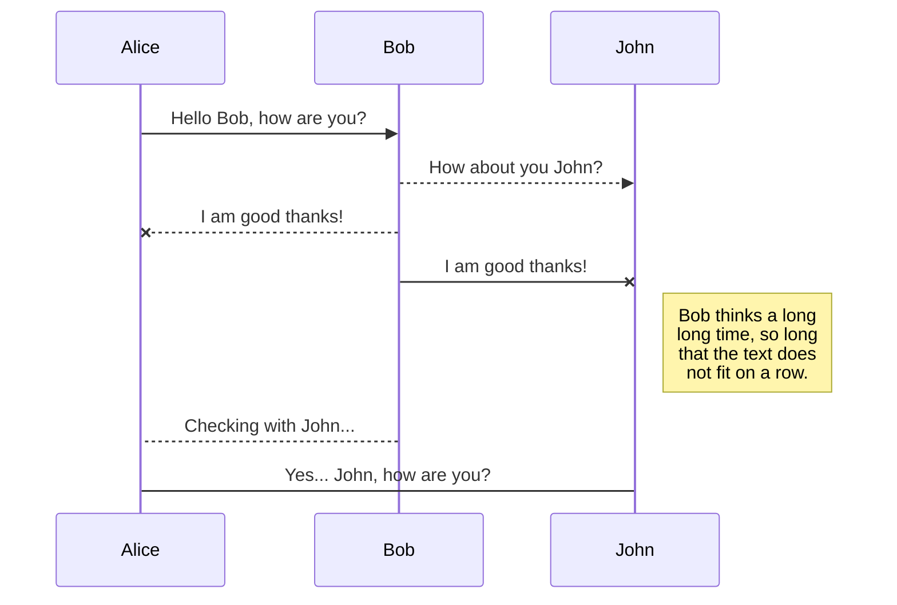
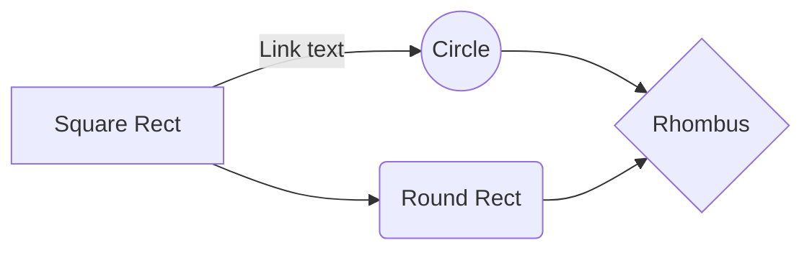

# Rapport de projet - Imac Tower Defense

**Cours d'algorithmique avancée - Cours de synthèse d'image**

*Cyrielle Lassarre, Guillaume Haerinck, Jules Fouchy*
*Année 1 - Promotion 2021*

## Table des matières

[**Introduction**](#introduction)

[**I - Présentation du jeu**](#i---présentation-du-jeu)
*	[**Intentions**](#intentions)
*	[**Game Design**](#game-design)
*  [**Points forts**](#points-forts)

[**II - L'architecture ECS**](#ii---larchitecture-ecs)
*  [**Contexte**](#contexte)
*  [**Principe**](#principe)
*  [**Implémentation**](#implémentation)

[**III -  En route vers le premier prototype**](#iii---en-route-vers-le-premier-prototype)
*	[**Utilisation d'openGL 4.4 core**](#utilisation-dopengl-4.4-core)
*	[**Ajout des dépendances**](#ajout-des-dépendances)
*	[**Création des entités**](#création-des-entités)
*	[**Construction du graphe**](#construction-du-graphe)

[**IV -  L'ajout de mécaniques de jeu**](#iv---lajout-de-mécaniques-de-jeu)
*	[**Déplacements et collisions**](#déplacements-et-collisions)
*	[**Le lancer de rayons**](#le-lancer-de-rayons)
*	[**Effets de feedbacks**](#effets-de-feedbacks)
*	[**Interface graphique avec Noesis**](#interface-graphique-avec-noesis)

[**V -  La solidification du projet**](#v---la-solidification-du-projet)
*	[**Direction artistique**](#direction-artistique)
*	[**Système de tuiles**](#système-de-tuiles)
*	[**Animations**](#animations)
*	[**Level design**](#level-design)

[**VI -  Post-Mortem**](#vi---post-mortem)
*	[**Cyrielle Lassarre**](#cyrielle-lassarre)
*	[**Guillaume Haerinck**](#guillaume-haerinck)
*	[**Jules Fouchy**](#jules-fouchy)

[**Conclusion**](#conclusion)

[**ANNEXE**](#annexe)
*	[**Différences avec le cahier des charges**]
*	[**Design pattern utilisés**]
*	[**Schéma UML du projet**]
*	[**Bibliographie**]
*	[**Lexique**](#lexique)

## Introduction

Avec ce projet, nous avions le souhait de créer une base de moteur de jeu assez solide pour être réutilisable lors de notre prochaine année à l'IMAC. En sachant que le temps passé à créer la structure d'un projet et à apprendre des librairies tierces est conséquent, nous avons décidé de réserver ce temps maintenant afin d'avoir une plus grande marge de manœuvre à l'avenir. En résulte de ce choix un projet avec de nombreuses dépendances, qui utilise de nombreux design patterns propre à l'industrie du jeu vidéo, et qui pousse ses systèmes dans leurs retranchements pour s'assurer qu'ils sont bien structurés. Les points techniques majeurs étant :

- Architecture logicielle en ECS,
- Utilisation de fichiers XAML pour les interfaces,
- Utilisation de OpenGl 4.4 core,
- Un jeu de Tower Defense aux mécaniques innovantes.

## I - Présentation du jeu

_Lasers, Mirrors & Robots_ est un jeu ...

### Intentions

### Game Design

### Points forts

## II - L'architecture ECS

### Contexte

### Principe

### Implémentation

## III - En route vers le premier prototype

### Utilisation d'openGL 4.4 core

### Ajout des dépendances

### Création des entités

### Construction du graphe

## IV - L'ajout de mécaniques de jeu

### Déplacements et collisions

### Le lancer de rayons

### Effets de feedbacks

### Interface graphique avec Noesis

## V - La solidification du projet

### Direction artistique

### Système de tuiles

### Animations

### Level design

## VI - Post-Mortem

### Cyrielle Lassarre

### Guillaume Haerinck

### Jules Fouchy

## Conclusion

## ANNEXE

### Différences avec le cahier des charges

### Design pattern utilisés

### Schéma UML du projet

### Webographie

### Lexique

*[ECS]: Entity Component System

# REMOVE ME

StackEdit extends the standard Markdown syntax by adding extra **Markdown extensions**, providing you with some nice features.

> **ProTip:** You can disable any **Markdown extension** in the **File properties** dialog.

## KaTeX

You can render LaTeX mathematical expressions using [KaTeX](https://khan.github.io/KaTeX/):

The *Gamma function* satisfying $\Gamma(n) = (n-1)!\quad\forall n\in\mathbb N$ is via the Euler integral

$$
\Gamma(z) = \int_0^\infty t^{z-1}e^{-t}dt\,.
$$

> You can find more information about **LaTeX** mathematical expressions [here](http://meta.math.stackexchange.com/questions/5020/mathjax-basic-tutorial-and-quick-reference).

## UML diagrams

You can render UML diagrams using [Mermaid](https://mermaidjs.github.io/). For example, this will produce a sequence diagram:

And this will produce a flow chart:

