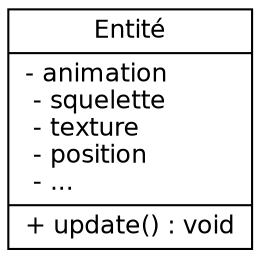
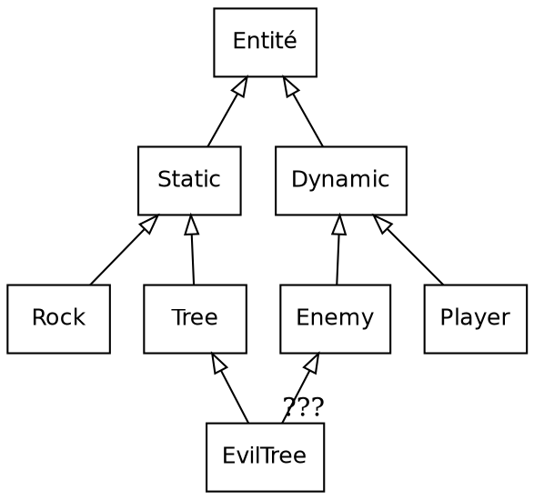
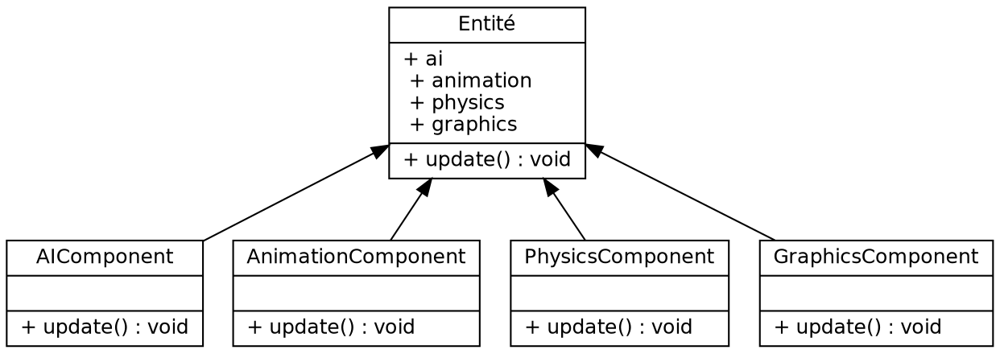

# Rapport de projet - Imac Tower Defense


**Cours d'algorithmique avancée - Cours de synthèse d'image**

*Cyrielle Lassarre, Guillaume Haerinck, Jules Fouchy*
*Année 1 - Promotion 2021*

## Table des matières

[**Introduction**](#introduction)

[**I - Présentation du jeu**](#i---présentation-du-jeu)
*	[**Intentions**](#intentions)
*	[**Game Design**](#game-design)
*  [**Points forts**](#points-forts)

[**II - L'architecture ECS**](#ii---larchitecture-ecs)
*  [**Contexte**](#contexte)
*  [**Principe**](#principe)
*  [**Implémentation**](#implémentation)

[**III -  En route vers le premier prototype**](#iii---en-route-vers-le-premier-prototype)
*	[**Utilisation d'openGL 4.4 core**](#utilisation-dopengl-4.4-core)
*	[**Ajout des dépendances**](#ajout-des-dépendances)
*	[**Création des entités**](#création-des-entités)
*	[**Fichier ITD et construction du graphe**](#fichier-itd-et-construction-du-graphe)

[**IV -  L'ajout de mécaniques de jeu**](#iv---lajout-de-mécaniques-de-jeu)
*	[**Déplacements des ennemis**](#déplacements-des-ennemis)
*	[**Lasers**](#lasers)
*	[**Effets de feedbacks**](#effets-de-feedbacks)
*	[**Interface graphique avec Noesis**](#interface-graphique-avec-noesis)

[**V -  La solidification du projet**](#v---la-solidification-du-projet)
*	[**Direction artistique**](#direction-artistique)
*	[**Système de tuiles**](#système-de-tuiles)
*	[**Animations**](#animations)
*	[**Level design**](#level-design)

[**VI -  Post-Mortem**](#vi---post-mortem)
*	[**Cyrielle Lassarre**](#cyrielle-lassarre)
*	[**Guillaume Haerinck**](#guillaume-haerinck)
*	[**Jules Fouchy**](#jules-fouchy)

[**Conclusion**](#conclusion)

[**ANNEXE**](#annexe)
*	[**Différences avec le cahier des charges**]
*	[**Design pattern utilisés**]
*	[**Schéma UML du projet**]
*	[**Bibliographie**]
*	[**Lexique**](#lexique)


## Introduction

En nous lançant dans ce projet, nous avions le souhait de créer une base de moteur de jeu assez solide pour être réutilisable lors de notre prochaine année à l'IMAC.

En sachant que le temps passé à créer la structure d'un logiciel et à apprendre des librairies tierces est conséquent, nous avons décidé de réserver ce temps maintenant afin d'avoir une plus grande marge de manœuvre à l'avenir. En résulte de ce choix un projet avec de nombreuses dépendances, qui utilise de plusieurs design patterns propre à l'industrie du jeu vidéo, et qui pousse ses systèmes dans leurs retranchements pour s'assurer qu'ils soient bien structurés. Les points techniques majeurs étant :

- Architecture logicielle en ECS,
- Création d'interfaces dans le language XAML,
- Utilisation de OpenGl 4.4 core

## I - Présentation du jeu


*Lasers, Mirrors & Robots* est un jeu en vue de 3/4 ou vous devez repousser vos aissaillants en plaçant des mirroirs aux points stratégiques. Les ressources disponibles étant rarement suffisantes, il faudra exploiter au maximum les unités déjà déployés pour arriver au bout de chaque niveau.

### Intentions

Le Tower Defense est un genre extrêmement codifié, si bien qu'il peut être compliqué de différencier les nombreux jeux flash du genre disponibles en ligne. Avec un peu de recherche, on peut cependant tomber sur des propositions vraiment intéressantes, ayant extraites certaines mécaniques du genre, mais s'étant dirigés vers une autre expérience.

À l'image de ces jeux, nous ne souhaitions pas créer un énième clone du genre, mais plutôt nous approprier le sujet en proposant quelque chose d'unique. Conscients des contraintes à respecter, nous avons décidé de 3 axes visant à apporter de la fraîcheur, tout en conservant la base du cahier des charges.

#### 1. Rendre le joueur actif pendant les vagues

Typiquement dans un Tower Defense, chaque niveau de jeu se divise entre une phase de construction et une phase d'attaque. Le joueur a des tours qu'il doit placer au mieux, puis il lance la vague pour voir si ses défenses tiennent bon. Avec un peu de chance, il gagnera assez de points pendant l'attaque pour construire de nouveaux bâtiments.

Le problème posé par cette structure est que le joueur n'a pas grand chose à faire lors de l'attaque, si ce n'est regarder ce qui se passe à l'écran et croiser les doigts pour se passe au mieux. C'est une structure qui fonctionne, mais qui commence à accuser son âge.

Afin de pallier cette inactivité, nous avons décidé de construire les niveaux de sorte à ce qu'il soit impossible de couvrir l'ensemble de la zone de jeu. La conséquence est que le joueur sera obligé de désactiver des lasers, et déplacer ses mirroirs à de multiples reprises pour suivre l'évolution de l'attaque.

#### 2. Proposer des choix intéressants

Tout jeu peut se résumer en une suite de choix. Qu'il s'agisse de sélectionner son opposant, un chemin à traverser, ou encore de placer des tours. Il est défini qu'un choix intéressant repose sur l'opposition entre un risque et une récompense. Plus grande pourrait être la récompense, plus grand sera le risque.

Dans un Tower Defense, les choix ont lieu lors de la sélection du type de tours, et lors du placement des unités. Cependant, il n'est pas rare que ces choix aient très peu de conséquences car le système est extrêmement permissif : il n'y a pas vraiment de mauvaise décision, et il est simple de rattraper un mauvais placement.

Pour ajouter du poid à ce genre de décisions, nous avons choisi de fixer le nombre d'unités qu'il est possible de créer par niveau, le compteur n'augmentera pas pendant la partie. Afin d'enfoncer le clou, certains niveaux nécessitent de sacrifier des constructions pour être terminés. En résulte un système où chaque placement à une importance cruciale.

> I wanted to force [the player] to make difficult decisions and experience both the satisfaction of choosing correctly and the regret of choosing poorly.
> **Derek Yu**, *Créateur de Spelunky*

Il est légitime de se demander si imposer de telles contraintes ne pourrait aller à l'encontre du jeu, et nuire à l'expérience. Nous pensons que la véritable question réside dans le choix d'expérience qu'un jeu veut proposer. Dans notre cas, nous choisissons l'aspect plus intense de ce spectre, car il propose des expériences - à notre sens - plus fun. À l'image de ce que peut être le jeu d'aventure/plateforme Spelunky face à un Mario.

#### 3. Résoudre plusieurs problèmes avec la même mécanique

Quand on commence le développement d'un jeu, et que plusieurs niveaux sont déja en route, il est récurrent d'imaginer de nouvelles mécaniques à utiliser et intégrer. L'expérience indique cependant que ce n'est pas forcément une bonne idée. Comme de nombreux game designer l'expliquent, avant de chercher ailleurs, il faut déja utiliser ce que l'on a.

> A good idea is something that does not solve just one single problem, but rather can solve multiple problems at once
> **Shigeru Miyamoto**, *Créateur de Mario*

Notre projet a une taille et une équipe réduite, qui a peu d'expérience. Pour rajouter du poid à cet argumentaire, développer de nombreuses fonctionnalités serait au mieux, irréaliste. C'est pour cela que l'entièreté de nos niveaux sont structurés autours de seulement trois types de constructions très différentes : des mirroirs, des lasers et des tours de glace.

Notre réflexion autour de ces éléments est toujours en cours. Parmi les mécaniques citées ici-bas, certaines ont été intégrés, et d'autres seront amenées à évoluer au fils des tests :

- Envoi de boules de feu quand le laser touche la tour de glace,
- Activation d'élement du décors par le laser,
- Activation et désactivation du laser pour éviter types d'enemis précis,
- Séparation du laser en deux si l'angle du mirroir est droit,
- Renvoi d'attaques enemies grâce aux mirroirs

### Game Design

[TODO Schéma du jeu avec les différents écrans. Indiquer les interactions possibles, les types d'ennemis, etc]

### Points forts

Au délà d'utiliser une architecture et des librairies avancées, nous avons pris soin d'intégrer ces quelques autres fonctionnalités pour améliorer le rendu en jeu.

Nom 		 					| Description
------------------------------- | ------------
Graphe à partir de l'image 		| Nous construisons le graphe sans le fichier .itd mais seulement en analysant pas-à-pas l'image du niveau, simplifiant ainsi l'écriture des fichiers .itd
Animations avec [Array Texture](https://www.khronos.org/opengl/wiki/Array_Texture)	| Nos entités animés le sont à l'aide de spritesheets, envoyées à openGl sous une donnée optimisée de Array Texture
Réflexion de lasers				| Notre mécanique de jeu principale repose sur le lancer de lasers à l'aide d'un algorithme récursif
Système de tuiles 				| Nous détectons pour chaque tuile de la carte les tuiles aux alentours afin d'adapter la texture
Animations de menu              | À l'aide de la bibliothèque Noesis et de Microsoft Blend, nous avons pu animer nos menus de jeu d'une façon semblable à des outils comme After Effects
Data Oriented                   | L'entièreté des données des niveaux sont récupérrés dans les fichiers .itd, c'est à dire pré-construction d'entités, durée des vagues, consitutions des menus, etc...


## II - L'architecture ECS

L'Entity Component System est un Design Pattern principalement utilisé lors de la conception de jeu vidéo.  C'est une architecture logicielle conçue à la fois pour optimiser la gestion de la mémoire, simplifier l'ajout de fonctionnalités et diviser les systèmes en parties totalement indépendantes. C'est un concept qui a progressivement émergé il y a une dizaine d'année et qui semble être devenu assez commun, bien qu'il existe, comme nous allons le voir, différents degrés dans son intégration.

### Contexte

Cela ne surprendra personne, créer un jeu, et plus particulièrement un moteur de jeu, est une tâche extrêmement complexe. À la lecture de [Game Engine Architecture](https://www.gameenginebook.com/), on comprend que ces logiciels sont des bêtes féroces autant dans la profondeur technique de ce qu'ils manipulent que dans la diversité des tâches à gérrer. Rendu, physique, animation, intelligence artificielle, pour ne citer que les pans les plus évidents, tous ces morceaux doivent être efficaces, bien organisé et surtout communiquer entre eux.

À la base de toute cette technique, repose le **principe d'entité**. Parfois appelé Actor comme dans l'Unreal Engine et Wolfenstein Engine ([véridique](https://maniacsvault.net/ecwolf/wiki/Classes:Actor)), ou même GameObject avec Unity3D. L'idée est d'avoir un type à la racine, assez abstrait, duquel l'essentiel des objets affichés à l'écran sont dérivés. Avoir une telle base commune permet au différents pans du moteur de manipuler aisément l'intégralité des objets sans avoir à ce soucier de leur type.

#### 1. Approche Monolithique

L'approche la plus simple consiste à avoir une classe de base qui possède elle-même les différents systèmes avec lesquels elle doit interragir.


<!--

-->

Le problème le plus évident posé par cette architecture est la **complexité**. Comme cette classe détient une grande partie de ce qu'est le moteur, elle est très lourde à manipuler et on peut se retrouver dans des projets conséquent avec une classe du genre grande de centaines et des centaines de ligne.

#### 2. Approche par Héritage

Afin d'alléger la classe Entité, il est possible de tirer parti de la programmation orientée objet en utilisant l'héritage. Avec cette approche, on peut définir les besoins progressivements, les sortants ainsi de la classe mère.


<!--

-->

Cependant, il peut devenir compliqué d'intégrer de nouvelles mécaniques de gameplay. L'exemple de "EvilTree" est assez parlant, à la fois Enemy et Tree, on ne pourrait le créer sans déclencher un **double héritage**, autorisé en C++, mais hautement déconseillé.

De plus, même si le code d'Entité a été simplifié, la division n'a pas été faite selon les systèmes du moteur de jeu. C'est à dire que le code gérant animation, physique et intelligence artificielle peut très bien être mélangé dans ces classes, posant des problèmes de performances et de maintenance.

> :fire: Bien que nous critiquons cette approche afin de nous amener à l'ECS, nous souhaitons préciser que des structures du genre plus complexes existent et s'en sortent très bien depuis des années.

#### 3. Approche par Aggrégation

En utilisant la POO avec un peu plus de subtilité, on se retrouve à faire de l'aggrégation, c'est à dire que les pans du moteurs de jeu intéragissant avec les entités ont maintenant leur classe propre, et sont possédés par la classe Entité. Il s'agit du design pattern [Component](http://gameprogrammingpatterns.com/component.html).


<!--

-->

Ce pattern à l'avantage de simplifier la structure et la compréhension du code, et permet aussi de mettre à jour les pans du moteurs de jeu dans un ordre précis.

```C++
void gameLoop() {
    for (entity in entities) {
        entity.ai.update();
    }
    for (entity in entities) {
        entity.animation.update();
    }
    for (entity in entities) {
        entity.physics.update();
    }
    for (entity in entities) {
        entity.graphics.update();
    }
}
```

Bien que cette approche possède de réelle qualité et soit souhaitable dans de nombreux cas, elle à un problème majeur : la **vitesse**. En effet, bien que la vitesse des processeurs se soit accrue, il n'en n'est pas de même pour la vitesse d'accès à la RAM.


Pour palier ce problème, les constructeurs ont intégrés au fil des années différentes mémoires caches directement sur le processeur, nommés par importances L1, L2 et L3. L'idée est, grossièrement, de passer les zones de mémoires de la RAM en cours d'utilisation dans ces mémoires caches coté processeur, beaucoup plus rapide d'accès, mais aussi très petites. L'efficacité de ce procédé repose sur le fait que les données en train d'être manipulées soit côte à côte dans la RAM, sous peine de rater l'emplacement **(cache miss)** et de devoir demander les données à la RAM.

Avec notre architecture telle qu'elle, voici notre RAM. Chaque entité possède 3 component, représenté par un carré de couleurs : un beige, un vert, et un violet. Les entités sont stockées à la suite, c'est une structure dîte **"Array of structure"**. Avec cette disposition, beaucoup de cache miss auront lieu lors de notre boucle principale, car on cherchera à accéder à tous les orange, puis tous les verts, puis tous les violets. Et la perte en terme de temps est assez collossale.


La solution à ce problème, est une structure en **"Structure of array"** représentée ci-dessous. Maintenant, les composants sont continus en mémoire, et le cache peut joueur son rôle efficacement.


Pour intégrer un tel fonctionnement, il est possible de créer un gestionnaire de mémoire à la main, qui irait s'occuper de cette allocation et du bon placement des composants. C'est une approche qui est loin d'être triviale, mais qui est courramment utilisé dans les moteurs de jeu pour s'assurer que la mémoire n'est pas fragmentée. DOOM y avait déja recours en 1991, comme indiqué dans [Game Engine Black book](http://fabiensanglard.net/gebbdoom/).

Cependant, ce n'est pas l'approche que nous avons emprunté. Face à ces problèmes, nous avons choisi d'utiliser l'ECS, car c'est une architecture qui offre nativement un gain de performance, et qui, - et c'est le point qui nous intéresse réellement - offre une **nouvelle façon de structurer son application**. 

### Principe

L'Entity Component System est une architecture assez déstabilisante quand on est habitué à l'orienté objet. Assez semblable à la manipulation d'une base de donnée type SQL, il faut se faire à l'idée de séparrer la logique dans des emplacement totalement séparrés du code.

#### 1. Les entités

Encore une fois, l'entité est au coeur de l'architecture. Cette classe a commencé a perdre du poid depuis le début du rapport, jusqu'à arriver à l'anorexie: dans une architecture ecs, **une entité n'est qu'un ID**, c'est à dire un entier, rien de plus.

Il est unique et permet, exactement comme dans une base de donnée, de faire des requêtes afin d'ajouter, de modifier et d'obtenir ses composants.

#### 2. Les composants

Les composants sont des **structures de données basiques** qui représentent un comportement en jeu. Par exemple, si une entité doit avoir une position dans le jeu, on vas lui assigner un composant "Transform", qui possède deux nombre flotants, x et y.

Chaque entité vas donc posséder un nombre plus ou moins important de composants selon la complexité de son comportement en jeu. Voici des exemples de composants basiques tiré d'un article sur l'[ECS](https://medium.com/@savas/nomad-game-engine-part-2-ecs-9132829188e5) :


#### 3. Les systèmes

Les systèmes sont l'endroit où la **logique du jeu** est traité. Ce sont eux qui s'occupent de parcourir les entités pour modifier leurs composants. On peut diviser notre application en autant de système que l'on souhaite, typiquement, ce sera les pans de notre moteurs de jeu (animation, physique, etc...) ainsi que la gestion de fonctionnalités avancées (construction, vagues, etc...).

Les systèmes vont récupérrer les entités en utilisant les composants comme requête. Seul les entités possédant l'ensemble des composants demandés dans la requête seront retournés. Afin d'affiner encore plus la recherche, il est courant de créer un composant jouant le rôle d'un tag. Les enemis par exemple, peuvent tous posséder un composant "EnemyTag". Voici une autre image tiré du même article pour illustrer les besoins des systèmes :


#### Les Avantages

On peut se demander pourquoi utiliser une architecture aussi radicallement différente pour créer son application. Déja évoqué plus haut, nous allons rappeler ici brièvement les raisons d'utiliser ce système :

- **Performance**: Les composants sont des structures de données basiques, stockées en "Structure of Array" et demandés en groupe. Il difficile de faire plus optimisé que ça.

- **Division**: Les systèmes regroupent la logique du jeu dans des classes totalement séparrés. Il sont mis à jour quand on le souhaite et dans l'ordre que l'on souhaite. Le code est organisé et on possède un contrôle total.

- **Prototypage**: Si on oublie le temps passé à comprendre l'ECS, une fois en route il est simple et rapide d'ajouter et de supprimer des fonctionnalités à la volée. Il suffi pour cela de créer un composant et de le gérrer dans un système

C'est une approche qui possède aussi des inconvénients, mais ces explications sont pour la fin du rapport.

### Implémentation

Créer une architecture d'une telle complexité par nos propres moyens aurait été une erreur.

En commençant le projet, nous voulions apprendre à utiliser, à penser en terme d'ECS. Nous avions qu'une vague compréhension de son fonctionnement, et nous manquions et manquons toujours de l'expérience et de l'expertise technique pour programmer un tel système. Nous sommes donc parti à la recherche de librairies C++.

> Give a man a game engine and he delivers a game. Teach a man to make a game engine and he never delivers anything.
> **@sandbaydev**

Deux librairies Libres et Open-Source sont actuellement réputés chez les développeurs de jeu indépendants : [EntityX](https://github.com/alecthomas/entityx) et [ENTT](https://github.com/skypjack/entt). La seconde possédant un développement actif, en plus d'être une amélioration directe de la première, nous avons choisi la **providence ENTT** :rainbow:.

Après trois mois à l'utiliser, nous pouvons affirmer que cette librairie est extrêmement bien conçue. En plus d'être rapide, cohérente, et bien documentée, elle possède, à l'image de SDL, de sous-bibliotèques qui sont susceptible d'être utilisé par tout développeur ayant recours à la libraire.

Dans notre cas, il s'agit de base d'implémentation pour les design pattern [Event Dispatcher](http://gameprogrammingpatterns.com/event-queue.html) et [Service Locator](http://gameprogrammingpatterns.com/service-locator.html) que nous utilisons lourdement dans notre jeu. Ces qualités, nous ne sommes pas les seul à les avoir reconnus, on peut remarquer que des jeux comme [Minecraft](https://www.minecraft.net/fr-fr/) (oui, minecraft rien que ça) utilisent ENTT dans leur développement.

Dans sa dernière version, la librairie requiert d'utiliser C\++17, ce qui est impossible pour builder sur les ordinateurs de Copernic. Nous utilisons donc une ancienne version, compatible avec C\++14 et qui compile à l'université.

#### La colonne vertébrale de notre application

Comme vous le constaterez tout au long de ce rapport, l'architecture de notre application s'est bâtie progressivement pour devenir assez complexe aujourd'hui. Néanmoins, deux objets sont au centre depuis le début et font fonctionner cette machinerie infernale :

- Le Registre
- L'Event emitter

Concrètement, **le Registre est notre base de données**. C'est un objet ENTT qui est obligatoire pour toute utilisation de la libraire, et c'est de lui qu'on crée les entités, ajoute des composants et effectue des requêtes pour récupérer et modifier les composants dans les systèmes. Il est crée dans le main, est passé par référence dans la quasi-totalité de nos classes. C'est simple, dès qu'un endroit du code à besoin de manipuler les entités, il est nescessaire d'avoir accès à cet objet.


<!--
```mermaid
graph TD
A[Publisher] -- Event -- B((Event Bus))
B -- Event -- C[Subscriber]
B -- Event -- D[Subscriber]
```
-->

L'Event emitter ensuite, est ce qui **assure la majeure partie de la communication** au sein de notre application. C'est d'ailleur le seul moyen de communiquer entre les systèmes. La syntaxe et le comportement sont semblables à ce que l'on peut retrouver en *javascript* avec les event-listener. L'idée, c'est qu'avec cet objet, on peut publier des évènements et y souscrire, le tout sans avoir besoin d'update cet objet directement dans une boucle. Le contenu de chacun de ces events est défini dans une structure de donnée très proche des components. 

Même s'il est moins propagé que le registre, cet objet est lui-aussi passé en référence dans le constructeur de nombreuses classes de notre jeu.

## III - En route vers le premier prototype

La première grande étape a été de rassembler toutes les dépendances et besoins techniques du projet, et de les faire fonctionner. Nous avons cherché à identifier nos besoins à l'avance afin de ne pas rajouter plus de complexité à un projet qui n'en manquait déja pas sur le papier.

### Utilisation d'OpenGL 4.4 core

Le premier challenge et la première réussite a été l'utilisation de la version moderne d'OpenGl. Au revoir glBegin() et glEnd(), et bonjour à vous les buffers et autres drawcalls. Nous avions commencé à apprendre OpenGl au lancement des cours de Synthèse d'image, donc bien avant le début du projet, ce qui nous a permi assez rapidement de passer cette étape.

Nous avons commencé notre apprentissage grâce aux excellents tutoriels du développeur [Yan Chernikov](https://www.youtube.com/user/TheChernoProject). Tout au long de ses vidéos, nous avons pu construire des classes pour abstraire les objets d'OpenGl et les manipuller plus aisément. L'essentiel de ces classes se trouvent dans le dossier *graphics*.

Bien que nous ne cherchions pas forcément la performance, mais plûtot à apprendre le fonctionnement de cette API, nous avons implémentés quelques optimisations offerte par OpenGL.

#### Array texture

C'est un type de texture présent dans le profil core depuis la version 3.0. L'idée est de stocker multiples textures dans un seul buffer afin de limiter le coût du "texture switching". Concretement, on y stocke une spritesheet, et on utilise un uniform dans le shader pour changer la tuile qui est active. Les textures coordinates restent les mêmes, sauf pour le paramêtre z qui correspond à la tuile à activer, c'est à dire l'index de ce tableau de texture.


#### Index Buffer

Très clairement inutile sachant que nous n'affichons des carrés composés de deux triangles, il n'empêche qu'utiliser un indexBuffer pour éviter de dupliquer les coordonnées de vertex dans le buffer envoyé à OpenGl est une bonne pratique, que nous avons donc utilisé.


#### Vertex Array partagés

Nous n'utilisons pas encore de "Instance Draw" qui permetterai d'indiquer à openGL qu'un même objet est déssiné plusieurs fois, cependant, nous partageons tout de même nos VertexArray entre les entités qui utilisent la même texture, au lieu d'en générrer une à chaque création.

On peut donc assimiler ce comportement au design pattern [FlyWeight](https://gameprogrammingpatterns.com/flyweight.html), car une seule instance d'une classe est utilisés pour plusieurs objets en jeu.


### Ajout des dépendances

[TODO Cmake, Puis listes des dépendances et de leurs utilités]

### Création des entités

[TODO Flyweight / Factory / Components]

### Fichier ITD et construction du graphe

L'ITD contient les informations sur le niveau : vie dont dispose le joueur, nombre d'ennemis de chaque type qui doivent apparaître, position et orientation des structures déjà placées ainsi que nombre de miroirs et tours à disposition.
La structure du niveau est elle récupérée dans l'image : un pixel représente une case, et sa couleur indique si c'est un chemin, une zone constructible ou une zone non-constructible.

Pour se déplacer les ennemis utilisent un graphe qui contient toutes les positions des embranchements, puisque ce sont les seuls endroits où ils doivent changer de direction.

Pour rendre l'édition et l'ajout de niveaux aussi simple que possible, devoir spécifier la position des embranchements du chemin dans le fichier ITD était un énorme frein ; ajoutez à cela que cette information est totalement redondante avec l'image décrivant le niveau et il ne nous en fallait pas plus pour nous décider à nous affranchir de cette contrainte.

Le graphe est donc créé en parcourant l'image vue elle même comme un graphe : on part de la case d'arrivée (puisqu'on sait qu'elle est unique et existe toujours) et on lance un parcours récursif sur chaque voisin de cette case qui est un chemin. Tant que la case actuelle n'est pas un embranchement (ce qu'on sait en regardant lesquels de ses voisins sont des chemins), on continue à avancer, et quand on tombe sur un embranchement on créé un nœud dans le graphe.


## IV - L'ajout de mécaniques de jeu

### Déplacements des ennemis

Pour se déplacer, les ennemis ont une stratégie très simple : ils choisissent un nœud et se déplacent vers lui en ligne droite, puis choisissent un nouveau nœud quand ils ont atteint leur cible.
Le choix du prochain nœud est à peine plus subtil : il est choisi au hasard, avec une probabilité inversement proportionnelle à la distance (calculée par Dijkstra) entre ce nœud et l'arrivée.
À cela il faut juste rajouter le fait que les ennemis se refusent à choisir le nœud dont ils viennent (à moins qu'ils n'arrivent à un cul-de-sac) et ne choisissent pas non plus un nœud qui les éloigne de l'arrivée (au sens de la norme 1), ce qui – essentiellement – leur évite de tomber dans des boucles.


### Lasers

Des lasers, des lasers, des lasers !
Les lasers sont réfléchis par les miroirs et infligent des dégâts à toutes les entités sur leur passage !
Pour trouver la trajectoire d'un laser, on calcule l'intersection entre la demi-droite partant de la tour et *tous* les miroirs (oui on n'est pas très subtils), garde le point le plus proche et relance un laser depuis ce point, avec l'angle $2\theta_{miroir} - \theta_{\textit{laser incident}}$. Et pour la collision entre le laser et les entités, on calcule la distance entre l'entité et sa projection orthogonale sur la droite, et vérifie si elle est plus petite que le rayon de la hitbox plus le rayon du laser. (Et on vérifie aussi qu'on est du bon côté de la demi-droite grâce au signe du produit scalaire utilisé pour calculer la projection orthogonale).

### Effets de feedback

Les héros de l'ombre du jeu vidéo ! Ceux qu'on ne remarque pas quand ils sont là, mais dont l'absence se fait cruellement sentir !

Comme tout bon héros de l'ombre, ils sont un peu partout : tremblement des entités et production d'étincelles quand elles sont touchées par un laser, ennemis qui bleuissent quand ils sont ralentis, tours qui clignotent quand elles sont sous un laser pour prévenir le joueur, tuile colorée en rouge ou vert lors du placement des structures pour indiquer la constructibilité de la case, entités qui explosent quand elles sont détruites, tremblement de l'écran quand le joueur perd de la vie, laser mis en valeur quand on passe la souris sous la tour pour bien distinguer quel effet aura la désactivation de celle-ci, laser mis en transparence tant qu'il est désactivé, curseur qui change pour indiquer l'action possible sur la structure (rotation des miroirs ou désactivation des tours).

### Interface graphique avec Noesis

[TODO expliquer un peu le principe, et la différenec entre le mode application et open]

## V - La solidification du projet

### Direction artistique

#### 1. Choix graphiques

Concernant le design de notre projet, plusieurs réflexions ont été menées et expérimentées. Afin d'exposer et de justifier notre choix graphique final, il est important de revenir sur les différentes versions établies afin de partager notre réflexion.

Dans la première version réalisée, nous avons choisi de travailler avec une vue de face afin de correspondre au premier story telling que nous avions imaginé et de pouvoir développer au maximum l'esthétique du projet. 
Néanmoins, la contrainte de la vue de face posait une difficulté quant au code. Ainsi, nous avons conservé les couleurs et le design de cette première version et l'avons déclinée en vue du dessus afin d'obtenir la seconde version. 


La seconde version reprenait l'esthétique de la première version en vue du dessus. Nous avons beaucoup travaillé sur cette version où nous avons imaginé des lasers changeant ainsi notre story telling. Néanmoins, bien que  fonctionnelle cette version manquait d'originalité esthétique. Elle entrainait des bordures noires et la vue du dessus entrainait une restriction quant à notre envie de créer un projet esthétique.


La version que nous avons choisi d'approfondir est celle que nous vous avons présentée dans ce rapport et lors de notre soutenance. Notre priorité était de consolider l'aspect esthétique. Pour cela, nous sommes passés à une vue de 3/4 proposant davantage d'opportunités graphiques. Nous avons choisi un décor de laboratoire détruit où les machines prendraient le dessus sur les scientifiques. L'aspect minimaliste a été privilégié afin de ne pas risquer de perdre le joueur et également par contrainte temporelle. Les couleurs ont été remplacées par des nuances de gris afin de différencier le décor des lasers.


#### 2. Choix des polices

Pour le corps de texte, nous avons choisi la police Sniglet disponible sur le site Dafont : https://www.dafont.com/sniglet.font. Ses arrondis permettent de contraster avec l'ambiance générale plutôt sérieuse et stricte en y apportant un aspect divertissant.


Pour les titres, nous avons également privilégié une police du site Dafont : https://www.dafont.com/fr/sunrise-international.font. Une fois de plus, elle constraste avec l'ambiance du jeu. Cette police a un aspect manuscrit qui contribue à ajouter une dimension humaine au projet afin de le rendre plus chaleureux. 


### Système de tuiles

### Animations

### Level design

[TODO Parler des autres jeux analysés, et du fait de ne plus pouvoir construire de lasers]

## VI - Post-Mortem

### Cyrielle Lassarre

À la suite de ce projet, plusieurs éléments pourraient être améliorés. En effet, nous pourrions envisagé l'apparition de plusieurs personnages afin de créer de nouveaux enjeux et d'augmenter la réflexion du joueur. Les animations, bien que déjà présentes, pourraient également être améliorées afin d'augmenter le feedback. Des vidéos au début de la partie permettraient de renforcer le story-telling de notre projet et de l'humaniser. 
Néanmoins, notre rendu respecte de nombreux critères établis par les consignes du projet et représente une réalisation pertinente pour la suite de notre parcours.
Ce projet m'a beaucoup appris, grâce au travail en équipe nottament ! L'ambition qu'a suscité ce projet au sein de notre trinôme m'a permis d'avancer dans un environnement de travail très agréable et stimulant ! J'aurais aimé abordé ce projet dans le cadre d'un workshop dédié afin que notre enthousiasme face à ce projet ne soit pas occulté par de nombreux autres travaux que nous avions à réaliser dans le cadre de notre formation à l'IMAC.  

### Guillaume Haerinck

### Jules Fouchy

Déjà un projet dont je suis très satisfait, et pourtant encore tant de choses à rajouter, notamment pour ma part toujours plus d'effets visuels, d'explosions, de fumée, de particules pour les lasers *etc.*
Ce projet m'aura énormément appris, sur le C++, sur le travail en équipe, sur le game design, . . . et surtout, j'ai découvert l'**ECS** !
Si au début découvrir cette architecture a été très compliquée car je ne savais pas où mettre mon code, comment accéder aux entités, *etc.*, désormais je ne sais plus comment m'en passer.
L'ECS permet une maléabilité du code inouïe, et une fois une grande variété de *components* codés, créer de nouveaux types d'entité se fait sans prise de tête, simplement en spécifiant les comportements qu'elles doivent avoir. De plus, on peut ajouter à la volée des propriétés à une quelconque entité, comme une animation par exemple, et les enlever tout aussi simplement. Pour rajouter des effets visuels c'est un vrai bonheur.

## Conclusion

## ANNEXE

### Différences avec le cahier des charges

### Design pattern utilisés

### Schéma UML du projet

### Bibliographie

#### Articles

[Tile Bitmasking](https://gamedevelopment.tutsplus.com/tutorials/how-to-use-tile-bitmasking-to-auto-tile-your-level-layouts--cms-25673)
[Nomad Game Engine](https://savas.ca/nomad)
[Data Oriented Design](http://gamesfromwithin.com/data-oriented-design)
[Programming lessons learned from making my first game](https://github.com/adnzzzzZ/blog/issues/31)
[Finishing a game](https://makegames.tumblr.com/post/1136623767/finishing-a-game)

#### Videos

[Is there more to Game Architecture than ECS ?](https://www.youtube.com/watch?v=JxI3Eu5DPwE)
[The art of screenshake](https://www.youtube.com/watch?v=AJdEqssNZ-U)
[Cherno OpenGL Playlist](https://www.youtube.com/playlist?list=PLlrATfBNZ98foTJPJ_Ev03o2oq3-GGOS2)

#### Livres

[Game Programming Patterns](https://gameprogrammingpatterns.com/)
[Game Engine Architecture](https://www.gameenginebook.com/)


## LEXIQUE

ECS
: Design Pattern architectural utilisé principalement dans l'industrie du jeu-vidéo
*[ECS]: Entity Component System

POO
: Paradigme de programmation qui permet de grouper des fonctions et des variables dans des structures de données appelées objets.
*[POO]: Programmation orientée objet

RAM
: Mémoire vive de l'ordinateur
*[RAM]: Random Access Memory

XAML
: Langage déclaratif développé par Microsoft semblable à du HTML
*[XAML]: eXtensible Application Markup Language
