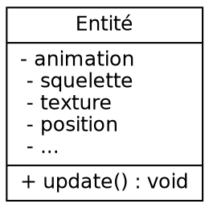
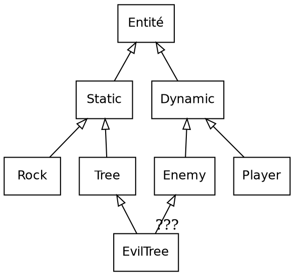
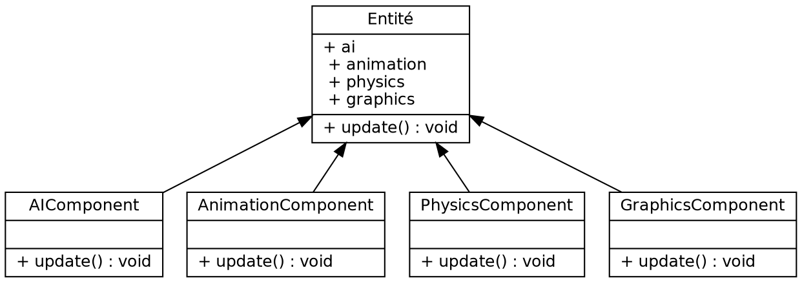
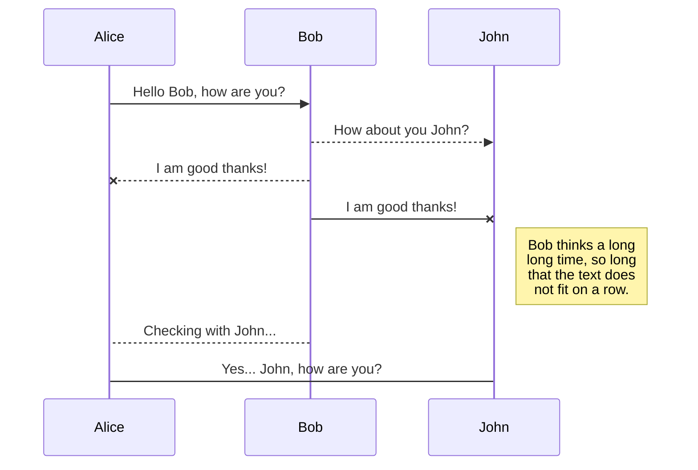
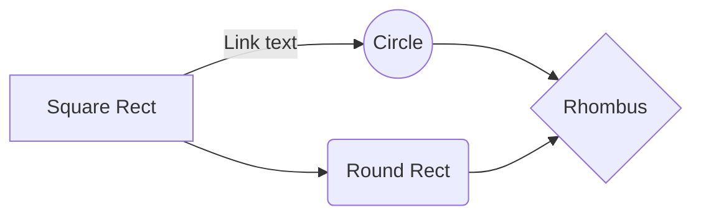

# Rapport de projet - Imac Tower Defense


**Cours d'algorithmique avancée - Cours de synthèse d'image**

*Cyrielle Lassarre, Guillaume Haerinck, Jules Fouchy*
*Année 1 - Promotion 2021*

## Table des matières

[**Introduction**](#introduction)

[**I - Présentation du jeu**](#i---présentation-du-jeu)
*	[**Intentions**](#intentions)
*	[**Game Design**](#game-design)
*  [**Points forts**](#points-forts)

[**II - L'architecture ECS**](#ii---larchitecture-ecs)
*  [**Contexte**](#contexte)
*  [**Principe**](#principe)
*  [**Implémentation**](#implémentation)

[**III -  En route vers le premier prototype**](#iii---en-route-vers-le-premier-prototype)
*	[**Utilisation d'openGL 4.4 core**](#utilisation-dopengl-4.4-core)
*	[**Ajout des dépendances**](#ajout-des-dépendances)
*	[**Création des entités**](#création-des-entités)
*	[**Construction du graphe**](#construction-du-graphe)

[**IV -  L'ajout de mécaniques de jeu**](#iv---lajout-de-mécaniques-de-jeu)
*	[**Déplacements et collisions**](#déplacements-et-collisions)
*	[**Le lancer de rayons**](#le-lancer-de-rayons)
*	[**Effets de feedbacks**](#effets-de-feedbacks)
*	[**Interface graphique avec Noesis**](#interface-graphique-avec-noesis)

[**V -  La solidification du projet**](#v---la-solidification-du-projet)
*	[**Direction artistique**](#direction-artistique)
*	[**Système de tuiles**](#système-de-tuiles)
*	[**Animations**](#animations)
*	[**Level design**](#level-design)

[**VI -  Post-Mortem**](#vi---post-mortem)
*	[**Cyrielle Lassarre**](#cyrielle-lassarre)
*	[**Guillaume Haerinck**](#guillaume-haerinck)
*	[**Jules Fouchy**](#jules-fouchy)

[**Conclusion**](#conclusion)

[**ANNEXE**](#annexe)
*	[**Différences avec le cahier des charges**]
*	[**Design pattern utilisés**]
*	[**Schéma UML du projet**]
*	[**Bibliographie**]
*	[**Lexique**](#lexique)


## Introduction

En nous lançant dans ce projet, nous avions le souhait de créer une base de moteur de jeu assez solide pour être réutilisable lors de notre prochaine année à l'IMAC.

En sachant que le temps passé à créer la structure d'un logiciel et à apprendre des librairies tierces est conséquent, nous avons décidé de réserver ce temps maintenant afin d'avoir une plus grande marge de manœuvre à l'avenir. En résulte de ce choix un projet avec de nombreuses dépendances, qui utilise de plusieurs design patterns propre à l'industrie du jeu vidéo, et qui pousse ses systèmes dans leurs retranchements pour s'assurer qu'ils soient bien structurés. Les points techniques majeurs étant :

- Architecture logicielle en ECS,
- Création d'interfaces dans le language XAML,
- Utilisation de OpenGl 4.4 core

## I - Présentation du jeu


*Lasers, Mirrors & Robots* est un jeu en vue de 3/4 ou vous devez repousser vos aissaillants en plaçant des mirroirs aux points stratégiques. Les ressources disponibles étant rarement suffisantes, il faudra exploiter au maximum les unités déjà déployés pour arriver au bout de chaque niveau.

### Intentions

Le Tower Defense est un genre extrêmement codifié, si bien qu'il peut être compliqué de différencier les nombreux jeux flash du genre disponibles en ligne. Avec un peu de recherche, on peut cependant tomber sur des propositions vraiment intéressantes, ayant extraites certaines mécaniques du genre, mais s'étant dirigés vers une autre expérience.

À l'image de ces jeux, nous ne souhaitions pas créer un énième clone du genre, mais plutôt nous approprier le sujet en proposant quelque chose d'unique. Conscient des contraintes à respecter, nous avons décidé de 3 axes visant à aporter de la fraicheur, tout en conservant la base du cahier des charges.

#### 1. Rendre le joueur actif pendant les vagues

Typiquement dans un Tower Defense, chaque niveau de jeu se divise entre une phase de construction et une phase d'attaque. Le joueur a des tours qu'il doit placer au mieux, puis il lance la vague pour voir si ses défenses tiennent bon. Avec un peu de chance, il gagnera assez de points pendant l'attaque pour construire de nouveaux bâtiments.

Le problème posé par cette structure est que le joueur n'a pas grand chose à faire lors de l'attaque, si ce n'est regarder ce qui se passe à l'écran et croiser les doigts pour se passe au mieux. C'est une structure qui fonctionne, mais qui commence à accuser son âge.

Afin de pallier cette inactivité, nous avons décidé de construire les niveaux de sorte à ce qu'il soit impossible de couvrir l'ensemble de la zone de jeu. La conséquence est que le joueur sera obligé de désactiver des lasers, et déplacer ses mirroirs à de multiples reprises pour suivre l'évolution de l'attaque.

#### 2. Proposer des choix intéressants

Tout jeu peut se résumer en une suite de choix. Qu'il s'agisse de sélectionner son opposant, un chemin à traverser, ou encore de placer des tours. Il est défini qu'un choix intéressant repose sur l'opposition entre un risque et une récompense. Plus grande pourrait être la récompense, plus grand sera le risque.

Dans un Tower Defense, les choix ont lieu lors de la sélection du type de tours, et lors du placement des unités. Cependant, il n'est pas rare que ces choix aient très peu de conséquences car le système est extrêmement permissif : il n'y a pas vraiment de mauvaise décision, et il est simple de rattraper un mauvais placement.

Pour ajouter du poid à ce genre de décisions, nous avons choisi de fixer le nombre d'unités qu'il est possible de créer par niveau, le compteur n'augmentera pas pendant la partie. Afin d'enfoncer le clou, certains niveaux nécessitent de sacrifier des constructions pour être terminés. En résulte un système où chaque placement à une importance cruciale.

> I wanted to force [the player] to make difficult decisions and experience both the satisfaction of choosing correctly and the regret of choosing poorly.
> **Derek Yu**, *Créateur de Spelunky*

Il est légitime de se demander si imposer de telles contraintes ne pourrait aller à l'encontre du jeu, et nuire à l'expérience. Nous pensons que la véritable question réside dans le choix d'expérience qu'un jeu veut proposer. Dans notre cas, nous choisissons l'aspect plus intense de ce spectre, car il propose des expériences - à notre sens - plus fun. À l'image de ce que peut être le jeu d'aventure/plateforme Spelunky face à un Mario.

#### 3. Résoudre plusieurs problèmes avec la même mécanique

Quand on commence le développement d'un jeu, et que plusieurs niveaux sont déja en route, il est récurrent d'imaginer de nouvelles mécaniques à utiliser et intégrer. L'expérience indique cependant que ce n'est pas forcément une bonne idée. Comme de nombreux game designer l'expliquent, avant de chercher ailleurs, il faut déja utiliser ce que l'on a.

> A good idea is something that does not solve just one single problem, but rather can solve multiple problems at once
> **Shigeru Miyamoto**, *Créateur de Mario*

Notre projet a une taille et une équipe réduite, qui a peu d'expérience. Pour rajouter du poid à cet argumentaire, développer de nombreuses fonctionnalités serait au mieux, irréaliste. C'est pour cela que l'entièreté de nos niveaux sont structurés autours de seulement trois types de constructions très différentes : des mirroirs, des lasers et des tours de glace.

Notre réflexion autour de ces éléments est toujours en cours. Parmi les mécaniques citées ici-bas, certaines ont été intégrés, et d'autres seront amenées à évoluer au fils des tests :

- Envoi de boules de feu quand le laser touche la tour de glace,
- Activation d'élement du décors par le laser,
- Activation et désactivation du laser pour éviter types d'enemis précis,
- Séparation du laser en deux si l'angle du mirroir est droit,
- Renvoi d'attaques enemies grâce aux mirroirs

### Game Design

TODO Schéma du jeu avec les différents écrans. Indiquer les interactions possibles, les types d'ennemis, etc

### Points forts

Nom 		 					| Description
------------------------------- | ------------
Graphe par analyse d'image 		| TODO
Animations avec Texture Atlas 	| TODO 
Lancer de rayons				| TODO
Système de tuiles 				| TODO 


## II - L'architecture ECS

L'Entity Component System est un Design Pattern principalement utilisé lors de la conception de jeu vidéo.  C'est une architecture logicielle conçue à la fois pour optimiser la gestion de la mémoire, simplifier l'ajout de fonctionnalités et diviser les systèmes en parties totalement indépendantes. C'est un concept qui a progressivement émergé il y a une dizaine d'année et qui semble être devenue assez commune, bien qu'il existe, comme nous allons le voir, différent degrés dans son intégration.

### Contexte

Cela ne surprendra personne, créer un jeu, et plus particulièrement un moteur de jeu, est une tâche extrêmement complexe. À la lecture de [Game Engine Architecture](https://www.gameenginebook.com/), on comprend que ces logiciels sont des bêtes féroces autant dans la profondeur technique de ce qu'ils manipulent que dans la diversité des tâches à gérrer. Rendu, physique, animation, intelligence artificielle, pour ne citer que les pans les plus évidents, tous ces morceaux doivent être efficaces, bien organisé et surtout communiquer entre eux.

À la base de toute cette technique, repose le **principe d'entité**. Parfois appelé Actor comme dans l'Unreal Engine et Wolfenstein Engine ([véridique](https://maniacsvault.net/ecwolf/wiki/Classes:Actor)), ou même GameObject avec Unity3D. L'idée est d'avoir un type à la racine, assez abstrait, duquel l'essentiel des objets affichés à l'écran sont dérivés. Avoir une telle base commune permet au différents pans du moteur de manipuler aisément l'intégralité des objets sans avoir à ce soucier de leur type.

#### 1. Approche Monolithique

L'approche la plus simple consiste à avoir une classe de base qui possède elle-même les différents systèmes avec lesquels elle doit interragir.



Le problème le plus évident posé par cette architecture est la **complexité**. Comme cette classe détiens une grande partie de ce qu'est le moteur, elle est très lourde à manipuler et on peut se retrouver dans des projets conséquent avec une classe avec des centaines et des centaines de ligne.

#### 2. Approche par Héritage

Afin d'alléger la classe Entité, il est possible d'utiliser l'héritage  afin de définir les besoins progressivements.



Le problème posé par cette nouvelle approche, déja la profondeur de la hierarchie qui n'est jamais quelque chose de souhaitable, et surtout, le **dreaded diamond of death**.

#### 3. Approche par Aggrégation

En utilisant la POO avec un peu plus de subtilité, on se retrouve à faire de l'aggrégation, c'est à dire que les pans du moteurs de jeu possède maintenant leurs classes, que l'on appèle des components, et sont utilisés par l'entité.




```C++
void gameLoop() {
    for (entity in entities) {
        entity.ai.update();
    }
    for (entity in entities) {
        entity.animation.update();
    }
    for (entity in entities) {
        entity.physics.update();
    }
    for (entity in entities) {
        entity.graphics.update();
    }
}
```

Cette approche résoud beaucoup de ploblèmes, mais elle est cependant assez **lente**, car la mémoire est trop segmentée.


### Principe

L'Entity Component System 

#### 1. Les entités

#### 2. Les composants


#### 3. Les systèmes


### Implémentation

Présenter ENTT

> Give a man a game engine and he delivers a game. Teach a man to make a game engine and he never delivers anything.

[Todo, l'event emitter et le registre pignon de l'app]

## III - En route vers le premier prototype

### Utilisation d'openGL 4.4 core

[TODO Parler de toutes les sources, et de pourquoi 4.4]

### Ajout des dépendances

[TODO Cmake, Puis listes des dépendances et de leurs utilités]

### Création des entités

[TODO Flyweight / Factory / Components]

### Construction du graphe

[TODO Jules analyse de l'image]

## IV - L'ajout de mécaniques de jeu

### Déplacements et collisions

[TODO Jules ]

### Le lancer de rayons

[TODO Jules]

### Effets de feedbacks

[TODO Jules]

### Interface graphique avec Noesis

[TODO expliquer un peu le principe, et la différenec entre le mode application et open]

## V - La solidification du projet

### Direction artistique

#### 1. Choix graphiques

Concernant le design de notre projet, plusieurs réflexions ont été menées et expérimentées. Afin d'exposer et de justifier notre choix graphique final, il est important de revenir sur les différentes versions établies afin de partager notre réflexion.

Dans la première version réalisée, nous avons choisi de travailler avec une vue de face afin de correspondre au premier story telling que nous avions imaginé et de pouvoir développer au maximum l'esthétique du projet. 
Néanmoins, la contrainte de la vue de face posait une difficulté quant au code. Ainsi, nous avons conservé les couleurs et le design de cette première version et l'avons déclinée en vue du dessus afin d'obtenir la seconde version. 

La seconde version reprenait l'esthétique de la première version en vue du dessus. Nous avons beaucoup travaillé sur cette version où nous avons imaginé des lasers changeant ainsi notre story telling. Néanmoins, bien que  fonctionnelle cette version manquait d'originalité esthétique. Elle entrainait des bordures noires et la vue du dessus entrainait une restriction quant à notre envie de créer un projet esthétique. 

La version que nous avons choisi d'approfondir est celle que nous vous avons présentée dans ce rapport et lors de notre soutenance. Notre priorité était de consolider l'aspect esthétique. Pour cela, nous sommes passés à une vue de 3/4 proposant davantage d'opportunités graphiques. L'aspect minimaliste a été privilégié afin de ne pas risquer de perdre le joueur et également par contrainte temporelle. Les couleurs ont été remplacées par des nuances de gris afin de différencier le décor des lasers.   

Choix du style graphique et des décors créés (labo)

#### 2. Choix des polices

Pour le corps de texte, nous avons choisi la police Sniglet disponible sur le site Dafont : https://www.dafont.com/sniglet.font. Ses arrondis permettent de contraster avec l'ambiance générale plutôt sérieuse et stricte en y apportant un aspect divertissant.

Pour les titres, nous avons également privilégié une police du site Dafont : https://www.dafont.com/fr/sunrise-international.font. Une fois de plus, elle constraste avec l'ambiance du jeu. Cette police a un aspect manuscrit qui contribue à ajouter une dimension humaine au projet afin de le rendre plus chaleureux. 

### Système de tuiles

### Animations

### Level design

[TODO Parler des autres jeux analysés, et du fait de ne plus pouvoir construire de lasers]

## VI - Post-Mortem

### Cyrielle Lassarre

Suite du design : créer des animations plus poussées, davantage de personnages en fonction des niveaux, améliorer le story telling 

### Guillaume Haerinck

### Jules Fouchy

## Conclusion

## ANNEXE

### Différences avec le cahier des charges

### Design pattern utilisés

### Schéma UML du projet

### Bibliographie

#### Articles

[Tile Bitmasking](https://gamedevelopment.tutsplus.com/tutorials/how-to-use-tile-bitmasking-to-auto-tile-your-level-layouts--cms-25673)
[Nomad Game Engine](https://savas.ca/nomad)
[Data Oriented Design](http://gamesfromwithin.com/data-oriented-design)
[Programming lessons learned from making my first game](https://github.com/adnzzzzZ/blog/issues/31)
[Finishing a game](https://makegames.tumblr.com/post/1136623767/finishing-a-game)

#### Videos

[Is there more to Game Architecture than ECS ?](https://www.youtube.com/watch?v=JxI3Eu5DPwE)
[The art of screenshake](https://www.youtube.com/watch?v=AJdEqssNZ-U)
[Cherno OpenGL Playlist](https://www.youtube.com/playlist?list=PLlrATfBNZ98foTJPJ_Ev03o2oq3-GGOS2)

#### Books

[Game Programming Patterns](https://gameprogrammingpatterns.com/)
[Game Engine Architecture](https://www.gameenginebook.com/)


## LEXIQUE

ECS
: Design Pattern architectural utilisé principalement dans l'industrie du jeu-vidéo
*[ECS]: Entity Component System

XAML
: Langage déclaratif développé par Microsoft semblable à du HTML
*[XAML]: eXtensible Application Markup Language

POO
: Paradigme de programmation qui permet de grouper des fonctions et des variables dans des structures de données appelées objets.
*[POO]: Programmation orientée objet

# REMOVE ME

StackEdit extends the standard Markdown syntax by adding extra **Markdown extensions**, providing you with some nice features.

> **ProTip:** You can disable any **Markdown extension** in the **File properties** dialog.


## KaTeX

You can render LaTeX mathematical expressions using [KaTeX](https://khan.github.io/KaTeX/):

The *Gamma function* satisfying $\Gamma(n) = (n-1)!\quad\forall n\in\mathbb N$ is via the Euler integral

$$
\Gamma(z) = \int_0^\infty t^{z-1}e^{-t}dt\,.
$$

> You can find more information about **LaTeX** mathematical expressions [here](http://meta.math.stackexchange.com/questions/5020/mathjax-basic-tutorial-and-quick-reference).


## UML diagrams

You can render UML diagrams using [Mermaid](https://mermaidjs.github.io/). For example, this will produce a sequence diagram:



And this will produce a flow chart:

